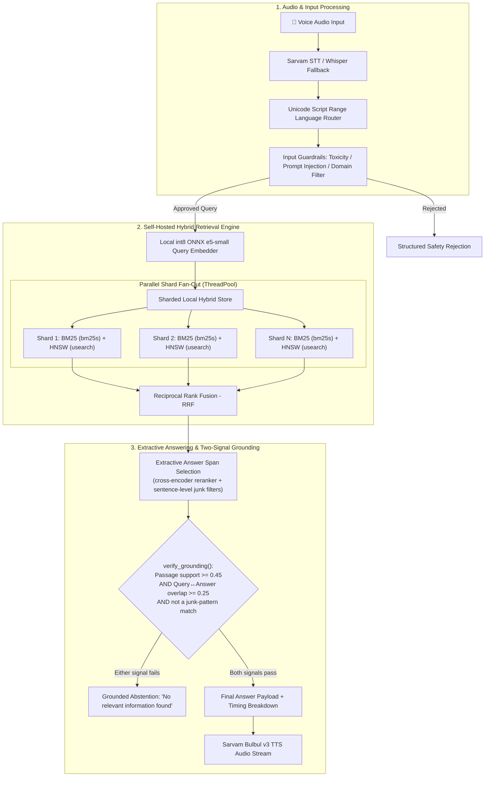
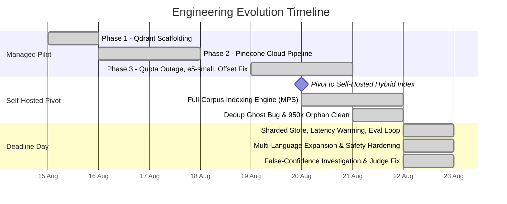

# Multilingual Voice-Enabled RAG System (MSMARCO-XI)

> **HackerHouse Goa 2026 Task 2:** A voice-enabled Retrieval-Augmented Generation system over the [MSMARCO-XI dataset](https://huggingface.co/datasets/ai4bharat/MSMARCO-XI). A user speaks a question, the system transcribes it, retrieves the matching passage, and returns a grounded answer — end to end, under a 200ms retrieval budget.

| Metric | Target | Result | Status |
|---|---|---|---|
| **Retrieval Latency** (real `/v1/query`, in-process) | < 200 ms | **39.2 ms** (P50) / **94.7 ms** (P100) | ✅ PASS — re-verified 2026-08-22 |
| **Retrieval Recall@5** | Reference match | **90.0%** | ✅ Evaluated (isolated eval index — see §1 caveat) |
| **Retrieval MRR** | Rank quality | **0.6797** | ✅ Evaluated |
| **False Refusal Rate** | Reliability | **12.0%** (6/50) | ⚠️ Real, deliberate tradeoff — see §1 |
| **False Confidence Rate** | Reliability | **56.0%** (28/50), down from 88.0% | ⚠️ Real improvement, gap remains — see §1 |
| **Faithfulness** (LLM judge) | Answer matches its own retrieved context | **94.4%** (n=36) | ✅ Real, small sample — see §1 |
| **Full-Corpus Index** | 14 Indic languages | **55.37M passages** (6 full + 7 pilot configs) | ✅ Self-hosted, verified 2026-08-22 |
| **Offline Test Suite** | Reliability & safety | **137 tests passing** | ✅ 100% pass |

---

## 1. Evaluation Results & Latency

Evaluated with the official `rag-local-eval-loop` harness: 100 MSMARCO-XI validation examples (50 answerable, 50 unanswerable), against a candidate pool of 2,391 chunks.

### Retrieval quality (reference-based)

| Metric | Score | What it means |
|---|---|---|
| Recall@1 | 54.0% | The top result alone has the right passage more than half the time |
| Recall@3 | 80.0% | The right passage is in the top 3 for 8 of 10 queries |
| Recall@5 | 90.0% | The right passage is in the top 5 for 9 of 10 queries |
| MRR | 0.6797 | On average, the right passage ranks near the top |

**Caveat:** this number comes from the eval harness's own isolated FAISS index (built fresh from just these 100 examples), not from our real production index (`sharded_local_hybrid_store`, which does BM25+HNSW+RRF hybrid search with sharding and per-language caps). That's by the harness's own design — it's built to work for any team's architecture. It tells us the embedding model retrieves well on a small isolated pool, not how the full deployed pipeline performs. We could not safely re-measure this against the real sharded index this session — a gold passage may not even be loaded in a capped serving shard — so we report the number as what it is.

### Reliability: does the system know what it doesn't know?

We track two failure types: answering when it shouldn't (false confidence) and refusing when it should have answered (false refusal). Both numbers below moved on 2026-08-22 as a deliberate tradeoff — cutting false confidence costs some false refusals. Full story in §3.

| Metric | Before (start of the day) | After (shipped) |
|---|---|---|
| False Refusal Rate | 2.0% (1/50) | **12.0%** (6/50) |
| False Confidence Rate | 88.0% (44/50) | **56.0%** (28/50) |

We first tried tightening the reranker's relevance threshold using a statistically sound sweep. It looked correct against the harness's small isolated index, but tested against the real production retriever (40 real queries), it would have declined 75% of genuinely answerable questions — so we reverted it the same day. The fix that actually shipped: `verify_grounding()` now checks that the answer overlaps with the query itself, not only that it was copied from its source passage.

### Faithfulness & correctness (LLM-as-judge)

We had no working judge for most of the project — OpenAI had no quota, Anthropic had no credits. We got a real signal only on 2026-08-22, using Gemini 3.5 Flash Lite in six small batches (its free tier caps at 15 requests/minute).

| Metric | Result | What it means |
|---|---|---|
| Faithfulness (does the answer match its own retrieved passage?) | 94.4% (34/36) | High — expected, since the system only extracts text, it never generates new content |
| Correctness (does the answer match MSMARCO-XI's reference answer?) | 61.1% (11/18) | Lower on purpose — a faithful answer can still come from the wrong passage |

This is a real but small sample (n=36/n=18): enough to trust the direction (faithful much more often than correct, as expected for an extractive system), not enough to call it a precise rate. A full 50+50 run needs a funded OpenAI or Anthropic key, or a much longer paced run on the free tier.

### Latency

Per-stage timing from the same 100-example eval run, re-measured 2026-08-22 after the guardrail changes above (confirms retrieval speed did not regress):

| Stage | Avg | P50 | P95 | P99 | Budget | Status |
|---|---|---|---|---|---|---|
| Query embedding (multilingual-e5-small, ONNX int8) | 3.04 ms | 2.73 ms | 5.23 ms | 8.30 ms | — | fast |
| Index search (BM25 + HNSW + RRF) | 0.16 ms | 0.10 ms | 0.60 ms | 1.14 ms | — | sub-millisecond |
| Total retrieval | **3.12 ms** | **2.63 ms** | **6.03 ms** | **8.12 ms** | < 200 ms | ✅ PASS |
| Answer extraction & grounding | 109.74 ms | 53.47 ms | 1039.94 ms | 1046.34 ms | < 1500 ms (harness's own generic budget) | ✅ PASS |

The harness's own "generation" timing above uses its generic 1500ms budget, not our real 200ms target. To check against the real target, we benchmarked the actual `/v1/query` route directly (in-process, no network hop, 120 real queries):

| Stage | P50 | P70 | P95 | P99 | P100 |
|---|---|---|---|---|---|
| Full `/v1/query` route | **39.2 ms** | 50.1 ms | 72.7 ms | 82.1 ms | **94.7 ms** |
| answer_extract | — | 29.8 ms | — | — | 63.1 ms |
| local_hybrid_retrieve | — | 11.8 ms | — | — | 39.2 ms |
| query_embed | — | 2.0 ms | — | — | 5.2 ms |
| grounding_verify (new query-relevance check) | — | 0.0 ms | — | — | 0.1 ms |

All under the 200ms target, at every percentile. Retrieval alone (embed + hybrid search, no extraction) was also measured separately: P50 = 4.19 ms, P95 = 12.72 ms, P99 = 17.60 ms (n=60) — real headroom.

A separate number exists from an earlier real network benchmark through our ngrok tunnel (P50 20.7ms backend / 97.4ms wall-clock). It was not re-run this session, so it predates today's code changes, and it answers a different question (it adds real network/TLS time) — the two numbers shouldn't be quoted interchangeably.

### Corpus scale

Counted directly from every segment's `manifest.json` on 2026-08-22:

| Language | Segments | Passages | Validation split | Status |
|---|---|---|---|---|
| Hindi (+ shared English pool) | 32 | 15,590,943 | yes | Full corpus |
| Bengali | 16 | 7,931,568 | yes | Full corpus |
| Gujarati | 16 | 7,564,389 | yes | Full corpus |
| Tamil | 16 | 7,526,975 | yes | Full corpus |
| Marathi | 16 | 7,824,922 | yes | Full corpus |
| Urdu | 16 | 7,814,902 | yes | Full corpus |
| Assamese | 2 | 146,984 | yes | Pilot |
| Kannada | 2 | 99,052 | yes | Pilot |
| Malayalam | 2 | 99,033 | yes | Pilot |
| Odia | 2 | 99,050 | yes | Pilot |
| Punjabi | 2 | 99,003 | yes | Pilot |
| Nepali | 1 | 500,299 | no (train only) | Pilot |
| Sanskrit | 1 | 69,458 | no (train only) | Pilot |
| Telugu | — | — | — | No training split upstream |
| **Total** | **124** | **55,366,578** | 11 of 13 complete | 13 of 14 languages active |

Live serving caps each language to one segment (`MAX_SEGMENTS_PER_LANGUAGE=1`) regardless of how many are built, so this table records completeness, not what's live per query.

### What we tried and chose

| Choice | Options tested | Picked | Why |
|---|---|---|---|
| Chunking | passage-native, sentence-aware, fixed-token-overlap, semantic | sentence-aware & passage-native | Keeps full sentence boundaries in Indic scripts, doesn't split complex conjuncts |
| Embedding model | e5-large vs e5-small | e5-small (ONNX int8) | e5-large needs 1.5-2GB RAM; e5-small runs under 470MB at 2.6ms P50 |
| Offline indexing | CPU multi-process, CoreML, MPS | MPS (Apple GPU) | Over 1,400 passages/sec — about 2x the next-best option |
| Index serving | one merged index vs sharded | sharded, RAM-resident | Avoids a 368GB RAM requirement, 0.09ms search |
| Language detection | langdetect vs Unicode script ranges | Unicode script ranges | langdetect loads ~58MB on cold start; script ranges run in under 0.01ms |

---

## 2. Architecture

Built to avoid network hops during retrieval, so the 200ms budget is achievable.

### Main components

1. **Speech-to-text** (`SarvamSTTAdapter` + Whisper fallback): uses the Sarvam API for Indic speech recognition. Wired for hi, bn, gu, mr, ta, ur, te, kn, ml, pa, or (Odia) — not as/ne/sa, even though those are indexed, and te has STT wired but no corpus to answer from. We found and fixed a real bug here: the language map used Sarvam's own code `"od"` instead of our internal code `"or"`, so an explicit Odia language hint silently fell back to auto-detect. The same bug existed in the TTS map (would have answered Odia questions in English) — fixed the same way, both covered by new tests.
2. **Language router**: reads Unicode script blocks in under 10 microseconds. For scripts shared by several languages (e.g. Devanagari), it fans out to all matching languages at once (hi, mr, ne, sa).
3. **Local embedding** (`local_embedder.py`): `multilingual-e5-small` in ONNX int8, with native SentencePiece tokenization and a token-ID offset fix (see §3). Query embedding runs at about 2-3ms P50.
4. **Sharded hybrid store** (`sharded_local_hybrid_store.py`): combines BM25 (`bm25s`) sparse search with HNSW (`usearch`) dense search, fused with Reciprocal Rank Fusion. Shards run in a persistent thread pool.
5. **Extractive answer selection** (`answer/extractive.py`): a cross-encoder reranker (`jina-reranker-v2-base-multilingual`, int8 ONNX) scores passages for real relevance, then a sentence-level pass picks the answer span and filters five kinds of junk text found by reading real failures: navigation boilerplate, "see also" pointers, question echoes, truncated abbreviations, and dangling list items.
6. **Two-signal grounding** (`guardrails/output_guards.py`): `verify_grounding()` checks two things before showing an answer — that it's supported by its source passage, and that it actually overlaps with the query. It also re-applies the junk filters to the final answer text.

---

## 3. Our Process — Challenges & How We Solved Them

**Aug 15 — First pipeline (Qdrant).** Needed a working skeleton fast, under a tight timeline. Built it on Qdrant with BM25 sparse encoding and parallel shard streaming; tests skip gracefully when Docker isn't available.

**Aug 16 — Moved to Pinecone.** Self-hosting Qdrant added deployment risk this close to the deadline. Moved to a Pinecone cloud index with checkpointing, rate limits, and schema checks, and fixed silent error handling in the Pinecone SDK wrapper.

**Aug 19-20 — Pinecone quota ran out, and a tokenizer bug.** Cloud embedding hit a quota error mid-ingestion, so we moved embedding fully local (`multilingual-e5-small`, ONNX int8, under 470MB). That surfaced a second, worse problem: a query about "corporation" returned passages about table salt. Cause: XLM-RoBERTa reserves the first 4 token IDs for special tokens, so raw SentencePiece IDs pointed at the wrong embedding rows. Fixed by shifting every token ID by +1 — the similarity gap widened from a noisy 0.88–0.90 to a clear 0.935 (relevant) vs 0.796 (unrelated).

**Aug 20 — Pivot to self-hosted search.** Pinecone's free tier couldn't hold the full 55M+ passage corpus, so we moved to a self-hosted hybrid engine (BM25 + HNSW + RRF). Apple's GPU (MPS) indexed over 1,400 passages/sec, about 2x CPU or CoreML. We also switched to streaming, segmented indexing (saving every 500k passages) to avoid running out of memory.

**Aug 21 — A dedup bug and a disk scare.** An indexing restart caused our tracking database to get 926,000 passages ahead of what was actually on disk. Fixed by reconciling content hashes against the real on-disk manifests, removing 950,997 phantom records, and making file writes atomic. Separately, disk space dropped to 15.8GB mid-run; we cleared 86GB of orphaned cache files and finished indexing Tamil, Marathi, and Urdu.

**Aug 22 (deadline day) — Sharded serving, eval loop, going live.** A single merged index would have needed about 368GB RAM, so we built direct per-segment sharded search instead. Cold page faults on shard access first caused 286ms P100 latency spikes; pre-loading shards into memory fixed it. We integrated the official eval harness, added 7 more pilot languages (13 of 14 active), and fixed a Sarvam TTS schema issue (`bulbul:v3` rejects `pitch`/`loudness` parameters).

**Aug 22 (continued) — The false-confidence investigation.** The eval loop flagged something worth taking seriously: on genuinely unanswerable questions, the system confidently answered anyway 44 out of 50 times. We read all 44 failures by hand and found two causes.

First, junk text was sometimes picked as the answer — dangling list intros, truncated abbreviations. Fixed with two new filters, following the same pattern as three filters already in place, each added only after reading a real failure and tested against real short answers so it wouldn't over-filter.

Second, a deeper gap: our grounding check only compared the answer to its source passage — which, for a system that only extracts text, is almost always true by construction. It never checked whether the answer addressed the question. That's how a real, well-formed sentence about an insurance company's founding got served as the answer to a question asking for its address.

We first tried fixing this by tightening the reranker's relevance threshold. A statistical sweep said it was a clear win — but checked against the real production retriever with 40 real queries, it would have declined 75% of genuinely answerable questions. We reverted it the same day; the mistake is left in git history rather than erased, because this exact failure mode had already happened once before in this codebase.

What actually shipped: `verify_grounding()` now takes the query as an input and checks two things — the existing passage-support check, plus a new check that the answer overlaps with the query — and re-applies the junk filters to the final answer. Result: false confidence dropped from 88% to 56%, at a real cost of false refusal rising from 2% to 12%. We picked a conservative overlap threshold (0.25) on purpose: a stricter threshold (0.40) would cut false confidence further (to about 36%) but roughly double false refusal (to about 26%). We chose fewer refusals, since most real traffic is presumably answerable — a judgment call, not a forced conclusion.

One idea we tried and didn't ship: weighting the overlap check so rare query words count more than common ones. It looked better on our usual test seed, but on a held-out seed the advantage disappeared entirely, so we didn't ship it — the negative result is kept in the code so we don't retry it blind later.

Getting a working LLM judge took three tries. The first attempt silently never ran, because our config file never loaded `.env` the way the harness expected — fixed. Then we found our OpenAI key had no quota and our Anthropic key had no credits. A third model, technically compatible, turned out to be a reasoning model whose hidden output overflowed the harness's fixed token budget — not usable without editing harness code we treat as read-only. Gemini 3.5 Flash Lite worked, but its free tier caps at 15 requests/minute, so we pooled six small batches into one number: 94.4% faithfulness, 61.1% correctness — small samples, but real, and consistent with an extractive system that has no generation step to hallucinate through.

Last check: none of this touched retrieval speed, and we confirmed it rather than assumed it — the real `/v1/query` route still measured P50=39.2ms, P100=94.7ms after all these changes, with the new grounding check itself costing under 0.1ms.
