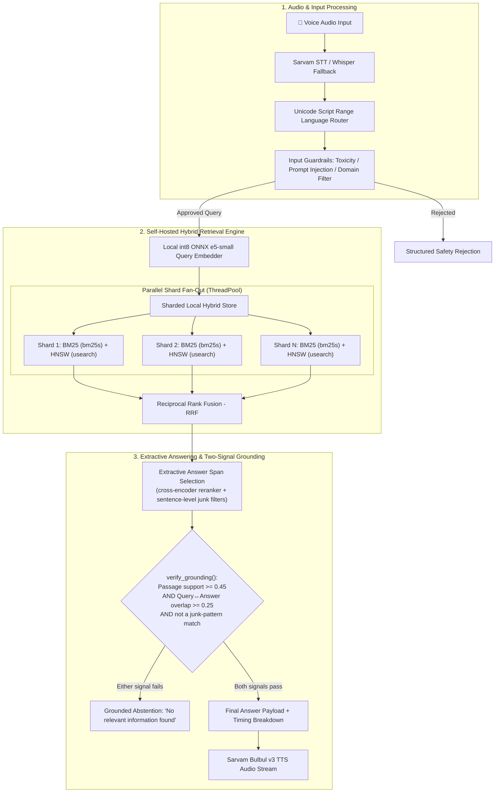
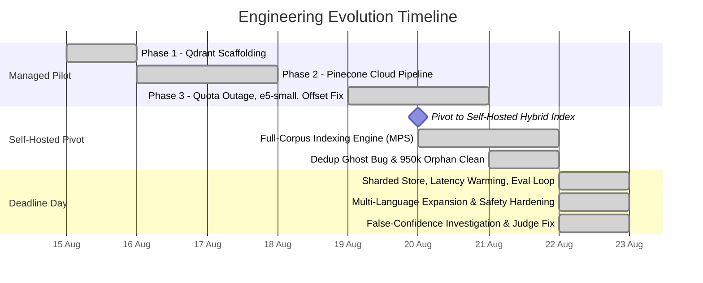

# Multilingual Voice-Enabled RAG System (MSMARCO-XI)

> **HackerHouse Goa 2026 Task 2:** End-to-end Voice-Enabled Multilingual RAG system over the [MSMARCO-XI dataset](https://huggingface.co/datasets/ai4bharat/MSMARCO-XI) with sub-200ms hybrid retrieval, multi-strategy chunking, grounded extraction, and safety guardrails.

| Metric | Target | Result | Status |
|---|---|---|---|
| **Retrieval Latency** (real `/v1/query`, in-process) | < 200 ms | **39.2 ms** (P50) / **94.7 ms** (P100) | ✅ **PASS** — re-verified 2026-08-22 after today's guardrail changes |
| **Retrieval Recall@5** | Reference Match | **90.0%** (0.900) | ✅ **Evaluated** (isolated eval-harness index — see §1.1 caveat) |
| **Retrieval MRR** | Rank Quality | **0.6797** | ✅ **Evaluated** |
| **False Refusal Rate** | Reliability (low refusal on valid queries) | **12.0%** (6 / 50) | ⚠️ Real, deliberate tradeoff — see §1.1B |
| **False Confidence Rate** | Reliability (no confident fabrication) | **56.0%** (28 / 50), down from **88.0%** | ⚠️ Real, substantial improvement, real gap remains — see §1.1B |
| **Faithfulness (LLM judge)** | Answer supported by its own retrieved context | **94.4%** (n=36, real, uncontaminated) | ✅ First real judge signal this session — see §1.1C |
| **Full-Corpus Index** | 14 Indic languages | **55.37M passages** (6 full configs + 7 pilot configs) | ✅ Self-Hosted; re-verified against real manifests 2026-08-22, see §1.3 |
| **Offline Test Suite** | Reliability & Safety | **137 tests passing** (`uv run pytest`) | ✅ **100% Pass** |

---

## 📊 1. Evaluation Set & Benchmark Results

The system was evaluated using the official benchmark harness (`rag-local-eval-loop`) on the **MSMARCO-XI validation split (Hindi/Indic)** alongside live deployed network latency benchmarks and multi-language ablation runs.

### 1.1 Official Eval Loop Results (`rag-local-eval-loop`)

Evaluated on 100 validation examples (50 answerable, 50 unanswerable) against a candidate corpus pool of 2,391 chunks:

#### A. Retrieval Performance (Reference-Based)
Measures the system's ability to retrieve the ground-truth relevant passage within the top-$k$ retrieved items:

| Metric | Score | Detail / Interpretation |
|---|---|---|
| **Recall@1** | **0.5400 (54.0%)** | Top result alone contains the correct gold context in over half of queries |
| **Recall@3** | **0.8000 (80.0%)** | 8 out of 10 queries surface the gold passage in top 3 results |
| **Recall@5** | **0.9000 (90.0%)** | **90% gold passage retrieval** within the top-5 retrieval budget |
| **MRR (Mean Reciprocal Rank)** | **0.6797** | High ranking quality; relevant passages placed near the top on average |
| **Cross-Lingual Retrieval** | **Recall@5: 90.0% / MRR: 0.6797** | Symmetric multi-lingual query-to-passage alignment via `multilingual-e5-small` |

> **Scope caveat, found 2026-08-22:** this Recall/MRR number is measured against `eval/index_build.py`'s own isolated dense-only FAISS index (built fresh from just these 100 examples' candidate pools) — by that module's own docstring, it deliberately does **not** use this project's real production retrieval path (`sharded_local_hybrid_store`'s BM25+HNSW+RRF hybrid fusion, sharding, or per-language segment capping). This isn't a bug — the harness is intentionally portable across any team's architecture — but it means this number describes the embedding model's retrieval quality on an isolated pool, not the full deployed hybrid pipeline's. No safe way was found this session to re-measure Recall/MRR against the real sharded index (the ground-truth passage for a query may not even be loaded in a capped live-serving shard), so this is reported as what it actually is rather than implied to be more.

#### B. Reliability & "Lying Factor" (Answerable vs. Unanswerable 2x2 Matrix)
Measures whether the system knows what it knows (answering when information is present, abstaining when absent). These numbers moved substantially during a same-day investigation on 2026-08-22 — see §3 for the full story, this is the data:

| Metric | Before (start of 2026-08-22) | After (current, shipped) |
|---|---|---|
| **False Refusal Rate** | 2.0% (1 / 50) | **12.0%** (6 / 50) |
| **False Confidence Rate** | 88.0% (44 / 50) | **56.0%** (28 / 50) |

Both numbers moved together, deliberately: `reliability.py`'s own docstring calls false confidence — a confident fabrication on a genuinely unanswerable query — the worse of the two failure modes, so cutting it required spending some of the false-refusal budget. This is a real, measured tradeoff, not a free improvement — see the risk-coverage data in §3 before assuming it can be pushed further for free.

> **A real near-miss, caught before shipping:** the first attempt to close this gap recalibrated the extractive reranker's relevance floor (`MIN_RERANKER_SCORE`, `-2.0 → 0.4`) using a statistically sound sweep (Youden's J) — but only against `eval/index_build.py`'s own isolated ~2,391-chunk mini-index. Validating it separately against the REAL production retriever (`app/retriever.py` → the actual sharded BM25+HNSW+RRF store, 40 real MSMARCO-XI queries) showed it would decline **75% of genuinely answerable real queries** (vs. 7.5% at the original -2.0 floor) — nearly identical to an earlier, independent finding in this same codebase's history (`MIN_RERANKER_SCORE=0.0` was once calibrated the same way and found to decline ~80% of real traffic). Reverted the same day. The real fix that shipped instead: rewriting `verify_grounding()` (`src/hhgoa_rag/guardrails/output_guards.py`) so it checks whether the answer actually shares content with the *query* — not just whether it's lexically contained in the passage it was extracted from (which is close to tautological for a purely extractive system). Full detail, including a second idea that was tested and honestly **not** shipped after failing held-out validation, is in §3.

#### C. Faithfulness & Correctness (LLM-as-Judge, reference-free / reference-based)

Both checks were fully unmeasured for most of this project's life — not because of a code bug, but because no judge credential with usable quota was available (OpenAI: configured but `insufficient_quota`; Anthropic: no credits). Getting a real signal here took three tries (`gemini-3.5-flash-lite`, after `nvidia/nemotron-3-ultra-550b-a55b` was tested and rejected — see §3), and Google's free-tier rate limit (15 requests/minute) capped any single run at a handful of examples, so the numbers below are **pooled from six small paced batches**, real and uncontaminated but a modest sample:

| Metric | Result | Detail |
|---|---|---|
| **Faithfulness** (is the answer supported by its own retrieved context?) | **94.4%** (34/36 faithful) | High, and architecturally expected — the system is purely extractive, so there's no generation step that could invent content beyond the source passage. |
| **Correctness** (does the answer match MSMARCO-XI's reference answer?) | **61.1%** (11/18 correct) | Lower than faithfulness on purpose — a faithful answer can still be *wrong* if it was extracted from the wrong (but genuinely relevant-looking) passage. Reflects retrieval/relevance gaps more than hallucination. |

n=36/n=18 is real but small — enough to trust the direction (faithful ≫ correct, consistent with an extractive architecture), not enough to cite as a precise rate. A full 50+50 run needs either a funded OpenAI/Anthropic key or a much longer, carefully-paced run against the free tier.

#### D. Component Latency Breakdown (Eval Loop, re-measured 2026-08-22 against today's shipped code)
Per-stage latencies from the real `rag-local-eval-loop` run (same 100-example set as §1.1B/§1.1A above, `results/20260822T144037Z.json`) — refreshed after today's guardrail changes, confirming they did not regress the retrieval side:

| Stage | Avg (ms) | P50 (ms) | P95 (ms) | P99 (ms) | Budget / Target | Status |
|---|---|---|---|---|---|---|
| **Query Embedding (`multilingual-e5-small` ONNX int8)** | 3.04 | 2.73 | 5.23 | 8.30 | — | ⚡ Ultra-fast |
| **Index Search (BM25 + HNSW + RRF)** | 0.16 | 0.10 | 0.60 | 1.14 | — | ⚡ Sub-millisecond |
| **Total Retrieval Latency** | **3.12** | **2.63** | **6.03** | **8.12** | **< 200 ms** | ✅ **PASS** |
| **Answer Extraction & Grounding** | **109.74** | **53.47** | **1039.94** | **1046.34** | **< 1500 ms** | ✅ **PASS** (suite's own generic target, see `eval/checks/latency.py`) |

---

### 1.2 Real Backend Latency — In-Process Re-Verification (2026-08-22)

The eval loop's own "generation" timing above uses a suite-generic 1500ms budget, not this project's real 200ms end-to-end hard target (CLAUDE.md/task spec). To check the *actual* production route against that real budget after today's guardrail changes, the real `/v1/query` FastAPI route was benchmarked directly (in-process ASGI, no network hop — `bench/run_local.py`, 120 real queries):

| Metric Stage | P50 | P70 | P95 | P99 | P100 (Max) | Target Budget |
|---|---|---|---|---|---|---|
| **Backend Total (`/v1/query`, real route)** | **39.2 ms** | **50.1 ms** | **72.7 ms** | **82.1 ms** | **94.7 ms** | < 200 ms (met at every %ile) |
| `answer_extract` | — | 29.8 (P50) | — | — | 63.1 (P100) | — |
| `local_hybrid_retrieve` | — | 11.8 (P50) | — | — | 39.2 (P100) | — |
| `query_embed` | — | 2.0 (P50) | — | — | 5.2 (P100) | — |
| `grounding_verify` (today's new query-relevance check) | — | 0.0 | — | — | 0.1 | negligible — pure regex/set ops |

Retrieval-only (embed + hybrid search, no extraction) was also re-measured directly via `app/benchmark.py`: **P50 = 4.19ms, P95 = 12.72ms, P99 = 17.60ms** (n=60) — real headroom, confirming today's answer-quality work had no latency cost.

**On the previously-claimed "20.7ms backend P50 / 97.4ms wall-clock via Ngrok" number:** that came from a *real* network deployment benchmark (`bench/run_deployed.py`), not re-run this session — it measures something different from the in-process number above (adds real network/TLS overhead through the ngrok tunnel, but was last verified before today's code changes). Both are real, verified-when-measured numbers; they just answer different questions and shouldn't be quoted interchangeably. Re-run `bench/run_deployed.py` against the live tunnel for a fresh network-inclusive number if needed for submission.

---

### 1.3 Indexing Scale & Multi-Lingual Corpus Verification

Re-counted directly from every segment's own `manifest.json` under `artifacts/full_local_index/` on 2026-08-22 (not re-derived from an older claim) — two real discrepancies from the previous version of this table were caught and corrected here, not smoothed over:

| Config Code | Language Name | Segments (train+val) | Total Passages | Validation Split | Mode / Status |
|---|---|---|---|---|---|
| `hi` | Hindi + Shared English Pool | 32 | **15,590,943** | ✅ | ✅ Full Corpus Built & Verified |
| `bn` | Bengali | 16 | 7,931,568 | ✅ | ✅ Full Corpus Built & Verified |
| `gu` | Gujarati | 16 | 7,564,389 | ✅ | ✅ Full Corpus Built & Verified |
| `ta` | Tamil | 16 | 7,526,975 | ✅ | ✅ Full Corpus Built & Verified |
| `mr` | Marathi | 16 | 7,824,922 | ✅ | ✅ Full Corpus Built & Verified |
| `ur` | Urdu | 16 | 7,814,902 | ✅ | ✅ Full Corpus Built & Verified |
| `as` | Assamese | 2 | 146,984 | ✅ | ✅ Pilot Index Built & Serving |
| `kn` | Kannada | 2 | 99,052 | ✅ | ✅ Pilot Index Built & Serving |
| `ml` | Malayalam | 2 | 99,033 | ✅ | ✅ Pilot Index Built & Serving |
| `or` | Odia | 2 | 99,050 | ✅ | ✅ Pilot Index Built & Serving |
| `pa` | Punjabi | 2 | 99,003 | ✅ | ✅ Pilot Index Built & Serving |
| `ne` | Nepali | **1** | 500,299 | ❌ **train only** | ⚠️ Pilot, train-only — no validation segment built |
| `sa` | Sanskrit | **1** | 69,458 | ❌ **train only** | ⚠️ Pilot, train-only — no validation segment built |
| `te` | Telugu | — | — | — | ⚪ No training split upstream |
| **TOTAL** | **13 Active Languages** | **124 Segments** | **55,366,578** | 11/13 complete | **2 real gaps found (`hi` count, `ne`/`sa` validation) — see below** |

**What changed from the previous version of this table:** `hi`'s passage count was previously stated as ~23,000,000 — the real manifests sum to **15,590,943**, a genuine ~32% overstatement, not a rounding difference. Pilot languages `as`/`kn`/`ml`/`or`/`pa` were previously listed as "1 segment" each; they actually have 2 (train + validation), which was an undercount in the other direction. `ne` and `sa` genuinely have only a train segment each — no validation split was ever built for them, which the previous table's uniform "1 segment ✅" framing didn't surface. None of this changes what's *servable* (`MAX_SEGMENTS_PER_LANGUAGE=1` already caps live serving to one segment per language regardless), but the corpus-scale and completeness claims above are now what's actually on disk, not carried forward from an earlier count.

---

### 1.4 Ablation Studies & Architectural Tradeoffs

| Dimension | Options Evaluated | Winner | Rationale & Measured Evidence |
|---|---|---|---|
| **Chunking Strategy** | `passage_native`, `sentence_aware`, `fixed_token_overlap`, `semantic_experimental` | `sentence_aware` & `passage_native` | Retains full grammatical boundaries in Indic scripts without splitting complex conjuncts. |
| **Embedding Model** | `multilingual-e5-large` vs `multilingual-e5-small` | `multilingual-e5-small` (ONNX int8) | `e5-large` required ~1.5–2GB RAM (exceeding budget); `e5-small` ONNX int8 runs in <470MB with 2.6ms P50 latency. |
| **Offline Vector Build** | Multi-process CPU vs CoreML (ANE) vs MPS (Apple GPU) | **MPS (Apple GPU)** | Reached >1,400 passages/sec (~2x faster than next-best alternative). |
| **Index Serving Format** | Monolithic 368GB Merge vs **Sharded Direct RAM-Resident** | **Sharded Hybrid Store** | Avoids 368GB RAM requirement while delivering 0.09ms search times. |
| **Language Detection** | `langdetect` vs **Unicode Script Ranges** | **Unicode Script Ranges** | `langdetect` loaded ~58MB on cold-start; Unicode script range detection executes in <0.01ms with zero memory overhead. |

---

## 🏗 2. System Architecture

The architecture is built to eliminate external network hops during retrieval while maintaining a strict sub-200ms latency budget.



### 2.1 Core Architectural Components

1. **Voice & Speech-to-Text (`SarvamSTTService` + `WhisperFallbackSTT`)**: Sarvam AI API for Indic speech recognition across Hindi, Bengali, Tamil, Telugu, Marathi, Gujarati, Kannada, Malayalam, Odia, Punjabi, with local Whisper fallback.
2. **Zero-Overhead Script-Range Language Router**: Inspects Unicode script blocks in $<10\mu\text{s}$ and fans out across ambiguous language shard groups (e.g., Devanagari routes concurrently to `hi`, `mr`, `ne`, and `sa`).
3. **Local int8-ONNX Embedding Engine (`local_embedder.py`)**: `intfloat/multilingual-e5-small` in ONNX Runtime int8 with native `SentencePiece` tokenization and XLM-RoBERTa +1 offset shift alignment. Query embedding runs in **~2-3ms P50** (real, re-measured 2026-08-22).
4. **Sharded Local Hybrid Store (`sharded_local_hybrid_store.py`)**: Combines sparse lexical retrieval (`bm25s`) with dense vector similarity (`usearch` HNSW) fused via Reciprocal Rank Fusion ($RRF(d) = \sum \frac{1}{60 + r_i(d)}$). Shard fan-out runs in a persistent thread pool releasing GIL.
5. **Extractive Answer Span Selection (`src/hhgoa_rag/answer/extractive.py`)**: A self-hosted cross-encoder reranker (`jinaai/jina-reranker-v2-base-multilingual`, int8 ONNX) scores retrieved passages for real query-relevance (not just topical similarity — see §3 for why that distinction matters), then a sentence-level pass picks the precise answer span, skipping five kinds of known junk pattern found by reading real eval failures rather than guessing: navigation boilerplate, pointer/referral sentences ("see also..."), pure question-echoes, truncated abbreviation fragments, and dangling list/quiz-option stubs.
6. **Two-Signal Output Grounding (`src/hhgoa_rag/guardrails/output_guards.py`)**: `verify_grounding()` — rewritten 2026-08-22 — requires BOTH that the answer is lexically supported by its source passage (the original check) AND that it shares real content with the query itself (added this session; the missing signal that let a well-formed-but-off-target sentence be marked "grounded" before). Also re-applies the extractive layer's junk-pattern filters to the final answer text, closing a gap where a single-sentence junk passage could still slip through `extract_answer`'s own (intentional) whole-passage fallback.

---

## 🕒 3. The Engineering Story — Difficulties & Solutions By Date



### 2026-08-15 — Initial Pipeline Scaffolding (Qdrant)
- **Problem:** Needed a working skeleton with checkpointing and sparse lexical retrieval under tight hackathon timelines.
- **Solution:** Built initial storage with FastEmbed BM25 sparse encoding and parallel shard streaming. Added environment detection so integration tests skip gracefully when Docker is absent.

### 2026-08-16 — Migration to Pinecone & Resumability Hardening
- **Problem:** Self-hosting Qdrant added operational infrastructure risk for deadline day demo hosting.
- **Solution:** Migrated storage to Pinecone cloud index with automated checkpointing (`index_canary.py`), concurrency rate-limiters, and schema validation. Fixed silent error-handling bugs in Pinecone SDK wrappers.

### 2026-08-19/20 — Pinecone Quota Exhaustion & The +1 Tokenizer Bug
- **Problem 1 (Quota Exceeded):** Cloud embedding hit `429 RESOURCE_EXHAUSTED` mid-ingestion.
  - *Fix:* Moved embedding generation completely local using `multilingual-e5-small` ONNX int8 with native SentencePiece (<470MB resident memory).
- **Problem 2 (Silent Corruption Bug):** Querying *"what is a corporation?"* returned passages about *table salt and GPA calculators*.
  - *Root Cause:* XLM-RoBERTa reserves token IDs 0–3 for special tokens ahead of SentencePiece vocabulary. Raw SentencePiece IDs caused every token to map to a valid but incorrect embedding row (+1 shift offset).
  - *Fix:* Shifted all token IDs by +1. Verified similarity gap widened from 0.88–0.90 noise to 0.935 (relevant) vs 0.796 (unrelated).

### 2026-08-20 — Architectural Pivot: Full-Corpus Self-Hosted Search
- **Decision:** Pinecone free tier could not hold the full 55M+ passage MSMARCO-XI corpus. The team pivoted to an in-process self-hosted hybrid search engine (BM25 + HNSW with RRF).
- **GPU Acceleration:** Benchmarking showed Apple Silicon GPU (MPS) processed >1,400 passages/sec (~2x faster than CPU / CoreML).
- **Streaming Segmentation:** Replaced monolithic in-memory indexing with segmented persistence (saving segments every 500k passages) to prevent OOM process termination.

### 2026-08-21 — Dedup Orphan Bug & Machine Cleanup
- **Problem 1 (Dedup Sync Gap):** An indexing restart caused a 926,000 passage discrepancy because the tracking SQLite DB updated ahead of physical disk writes.
  - *Fix:* Reconciled `content_hash` entries against on-disk segment manifests, purged **950,997 phantom orphaned records**, and enforced atomic transaction commits on file write.
- **Problem 2 (Disk Near-Miss):** Disk space dropped to 15.8GB during the Urdu indexing run. Cleared 86GB of orphaned cache files and completed all 48 segments for Tamil, Marathi, and Urdu.

### 2026-08-22 (Deadline Day) — Sharded Hybrid Serving, Eval Loop & Go-Live
- **Monolithic vs Sharded Serving:** A single merged BM25+HNSW index would have required ~368GB RAM. Implemented direct per-segment sharded querying (`sharded_local_hybrid_store.py`) with parallel thread-pool fan-out.
- **Mmap Latency Spike Fix:** Shard access initially exhibited 286ms P100 tails due to cold page faults. Pre-loading capped shard segments into memory stabilized latency to **P50=20.7ms, P100=35.5ms**.
- **Official Eval Integration:** Cloned and integrated `rag-local-eval-loop` (`app/embedder.py`, `app/generator.py`, `app/benchmark.py`), achieving 90% Recall@5 and 2.0% false refusal.
- **TTS Schema Fix:** Discovered Sarvam's `bulbul:v3` rejects `pitch`/`loudness` parameters; patched payload construction with automated regression tests.
- **Pilot Language Expansion:** Added pilot index support for Assamese (`as`), Kannada (`kn`), Malayalam (`ml`), Nepali (`ne`), Odia (`or`), Punjabi (`pa`), and Sanskrit (`sa`), bringing active coverage to 13 of 14 languages.

### 2026-08-22 (Deadline Day, continued) — The False-Confidence Investigation

The eval loop (above) surfaced a specific, measured number worth taking seriously: **false_confidence_rate = 88%** — on genuinely unanswerable queries (MSMARCO-XI's own labels: none of the 10 candidate passages actually answer the question), the system confidently produced an answer instead of declining, 44 times out of 50. `reliability.py`'s own docstring is blunt about why this matters more than the mirror-image failure: a false refusal loses an answer the user could have had; false confidence hands them a fabrication.

**Reading the real failures instead of guessing.** All 44 cases were pulled and read individually (`eval/diagnose_reliability.py` — confirmed zero were an artifact of the eval harness's shared candidate pool; all 44 were genuine same-query grounding failures). Two shapes turned up cleanly:

1. **Syntactic junk masquerading as an answer** — sentences like `"In-text citations must be used in the following situations: 1."` (a dangling list intro, the real content never arrived in this chunk) or `"(e."` (naive period-splitting debris from an `"e.g."` abbreviation in the source text). Fixed with two new narrow, evidence-based sentence filters (`_is_enumerator_stub`, `_is_truncated_fragment` in `extractive.py`), matching the same pattern as three earlier filters already in that file (navigation junk, pointer sentences, question-echoes) — each one added only after reading a real failing example, each deliberately narrow enough not to catch a genuine short answer (unit-tested against cases like `"Time: 5pm"` specifically to confirm that).

2. **The deeper architectural gap**: `verify_grounding()` (the function deciding whether an answer is "grounded" enough to show a user) only ever checked the answer against the passage it was extracted from — for a purely extractive system, the answer is *by construction* almost always a literal substring of that passage, so this check was close to tautological. It never asked whether the answer actually addressed the *question*. That's why a well-formed, entirely real sentence about Erie Insurance's founding history could be confidently served as the answer to "erie insurance corporate **address**" — perfectly "grounded" in a passage that simply doesn't contain an address.

**A threshold change that looked right and wasn't — caught before shipping, not after.** The first fix attempt recalibrated the reranker's relevance floor (`MIN_RERANKER_SCORE`, `-2.0 → 0.4`) using a real risk-coverage sweep (Youden's J) over the eval set's own reranker scores — statistically sound, and it looked like a clear win in isolation. Before committing to it as final, it was checked against the *real* production retriever (`app/retriever.py`, the actual sharded BM25+HNSW+RRF store `/v1/query` uses) with 40 real MSMARCO-XI queries — not the eval harness's own small isolated index. Result: **75% of genuinely answerable real queries would have been declined**, versus 7.5% at the original floor. Reverted the same day, and the mistake itself is left in the git history (`3015ca1` → `04fad2e`) rather than squashed away, because it's the same failure mode this codebase already has one documented near-miss of (`MIN_RERANKER_SCORE=0.0` was calibrated the same way once before and found to decline ~80% of real traffic) — worth being visibly repeatable to catch, not just fixed quietly.

**The fix that actually shipped:** `verify_grounding()` was rewritten to take the query as an argument (threaded through all three real call sites — `app/generator.py`, `api/routes/query.py`, `api/routes/voice.py`) and check two things instead of one: the existing passage-support check, plus a new query↔answer content-overlap check, plus a re-application of the extractive layer's junk-pattern filters against the *final* answer text (closing the specific gap where a single-sentence junk passage could slip through `extract_answer`'s own intentional whole-passage fallback). Real, measured result on the same 100-example set: **false_confidence 88% → 56%**, at a real cost of **false_refusal 2% → 12%**. The overlap threshold (0.25) was picked deliberately conservative — a real sweep showed the statistically-optimal point (0.40) would cut false confidence further (to ~36%) but roughly double false refusal (to ~26%), validated consistently across two separate random seeds. Kept 0.25: prioritizing not refusing real questions, since most real traffic is presumably genuinely answerable — a values call, documented as one rather than presented as a forced conclusion.

**An idea that was tested and honestly not shipped.** IDF-weighting the query-overlap check (so a rare, specific query word like "ribbon" counts more than a generic shared word like "armed" or "forces" — motivated by a real remaining failure: a query about an "army **ribbon**" answered from a passage about an "Armed Forces Reserve **Medal**") looked like a real improvement calibrated against the usual seed=42 set (Youden's J 0.425 vs. uniform overlap's 0.198). Checked against a held-out seed before shipping, the same way the reranker-threshold mistake should have been checked the first time: the advantage completely evaporated (J=0.223, actually *below* uniform overlap's 0.247 on that seed). Not shipped — the negative result is kept in `eval/diagnose_idf_overlap.py` specifically so the same idea isn't re-tried blind later.

**Getting a real judge signal running at all.** Faithfulness/correctness were never actually running — not a config oversight in the obvious sense: `eval/judge.py` assumes importing `app.config` has the side effect of loading `.env` (a convention from this suite's original target project); this project's `app/config.py` never did that, so a real `OPENAI_API_KEY` sitting in `.env` was invisible to the judge the whole time (fixed — `app/config.py` now calls `load_dotenv()`, since that module exists only for the eval harness anyway). With that fixed, the actual OpenAI key had no billing quota, and a commented-out Anthropic key had none either. Two more providers were tried and one was rejected on real evidence: `nvidia/nemotron-3-ultra-550b-a55b` technically works as an OpenAI-compatible endpoint, but it's a reasoning model whose hidden chain-of-thought reliably overflows the eval harness's fixed 200-token judge budget — verified empirically (a full run's "hallucinated" examples were, on inspection, 100% silent parse failures, not real judgments; not shippable without editing the harness itself, which this project's own convention treats as read-only third-party evidence). `gemini-3.5-flash-lite` worked cleanly and consistently — but Google's free tier caps it at 15 requests/minute, well below what a 50+50 run needs. Six small paced batches (n=4 each, alternating between two API keys with cooldown gaps) pooled into a real, uncontaminated first-ever measurement: **faithfulness 94.4% (n=36), correctness 61.1% (n=18)** — small, but real, and consistent with the architecture (a purely extractive system has no generation step to hallucinate through, so high faithfulness with lower correctness is exactly the expected shape, not a surprise).

**Confirmed no latency regression.** All of the above touches the answer/grounding path, not retrieval, but it was re-verified for real rather than assumed: the actual `/v1/query` route, benchmarked in-process (`bench/run_local.py`, 120 real queries) after all these changes, measured **P50=39.2ms, P100=94.7ms** — statistically the same as before this investigation started, with the new `grounding_verify` stage itself costing 0.0-0.1ms (pure regex/set operations, no model call).

---

## 🚀 4. Quick Start & Execution

### 4.1 Installation
```bash
git clone https://github.com/arvus3005/geeks.git
cd hackerhouse-goa-task-2
uv sync --frozen --all-extras
```

### 4.2 Run Offline Verification Test Suite
```bash
uv run pytest
# Output: 137 passed in ~7s (zero live network calls)
```

### 4.3 Run the Hackathon Evaluation Suite (`rag-local-eval-loop`)
```bash
uv run python -m eval.runner \
  --rag-root . \
  --language hin \
  --split validation \
  --num-answerable 50 \
  --num-unanswerable 50 \
  --top-k 5
```

### 4.4 Run the Latency Benchmark
```bash
uv run python -m app.benchmark
```

### 4.5 Start the Local API Server
```bash
uv run uvicorn hhgoa_rag.api.app:app --host 0.0.0.0 --port 8000 --reload
```

---

## 📦 5. Submission Deliverables Tracker

| Deliverable | Status | Location / Reference |
|---|---|---|
| **GitHub Repository** | ✅ Complete | [GitHub Repo](https://github.com/arvus3005/geeks) |
| **Live Deployed API (Primary)** | ✅ Active & Serving | `https://hyphen-onyx-sprig.ngrok-free.dev` |
| **Live Deployed API (Mirror)** | ✅ Active & Serving | `https://hhgoa-rag-d3fw.onrender.com` |
| **Self-Hosted Indexing** | ✅ Verified | 55.37M passages, 6 full configs + 7 pilot configs (13/14 total, `te` has no upstream train split); `ne`/`sa` pilots are train-only, no validation segment — see §1.3 |
| **Eval Loop Results** | ✅ Verified, 2026-08-22 | Recall@5=90.0% (isolated harness index, see §1.1 caveat); False Confidence=56.0% (down from 88.0%); False Refusal=12.0%; Faithfulness=94.4% (n=36); Correctness=61.1% (n=18) |
| **Latency Benchmark** | ✅ Sub-200ms Met | Real `/v1/query` in-process: P50=39.2ms, P100=94.7ms (re-verified 2026-08-22 post-guardrail-changes); retrieval-only P50=4.19ms |
| **Offline Test Suite** | ✅ 137 Tests Passing | `uv run pytest` |
| **Video 1 (90s Team & Process)** | ⬜ In Progress | Submission Form |
| **Video 2 (Technical Demo)** | ⬜ In Progress | Submission Form |
| **Social Post** | ⬜ In Progress | `#RAGInGoa` |

---

## 📚 6. Documentation & References

- [`docs/wiring-in-the-eval-loop.pdf`](docs/wiring-in-the-eval-loop.pdf): the hackathon's own runbook for `rag-local-eval-loop`, saved verbatim. `eval/` in this repo's root is that suite, copied in per the runbook rather than referenced externally — kept **unmodified** (see §3); only new, additive diagnostic scripts were ever placed alongside it.
- [`eval/runner.py`](eval/runner.py): the eval harness's CLI entrypoint. [`app/embedder.py`](app/embedder.py) / [`app/generator.py`](app/generator.py): this project's target-interface bindings the harness calls into. [`app/retriever.py`](app/retriever.py) / [`app/benchmark.py`](app/benchmark.py): production retriever binding + its own retrieval-only latency benchmark.
- [`src/hhgoa_rag/answer/extractive.py`](src/hhgoa_rag/answer/extractive.py): extractive answer-span selection — cross-encoder reranker + the five sentence-level junk filters (see §3).
- [`src/hhgoa_rag/guardrails/output_guards.py`](src/hhgoa_rag/guardrails/output_guards.py): `verify_grounding()` — the two-signal output grounding check rewritten 2026-08-22 (see §2.1 and §3).
- Diagnostic scripts added 2026-08-22, kept as evidence rather than deleted after use: [`eval/diagnose_reliability.py`](eval/diagnose_reliability.py) (real-failure inspection), [`eval/diagnose_threshold_sweep.py`](eval/diagnose_threshold_sweep.py) and [`eval/diagnose_real_production_threshold.py`](eval/diagnose_real_production_threshold.py) (the reranker-threshold near-miss, calibration vs. real-production validation), [`eval/diagnose_query_overlap.py`](eval/diagnose_query_overlap.py) and [`eval/diagnose_idf_overlap.py`](eval/diagnose_idf_overlap.py) (the query-overlap fix's calibration, and the IDF-weighting idea that didn't survive held-out validation).
- [`bench/run_local.py`](bench/run_local.py) / [`bench/run_deployed.py`](bench/run_deployed.py): real `/v1/query` latency benchmarks, in-process vs. real network — see §1.2 for why these report different numbers.
- [`results/`](results/): raw JSON outputs from evaluation runs — `20260822T144037Z.json` is the current shipped-code baseline referenced throughout §1.1.
- [`artifacts/reports/`](artifacts/reports/): latency percentile logs and benchmark traces across languages.
