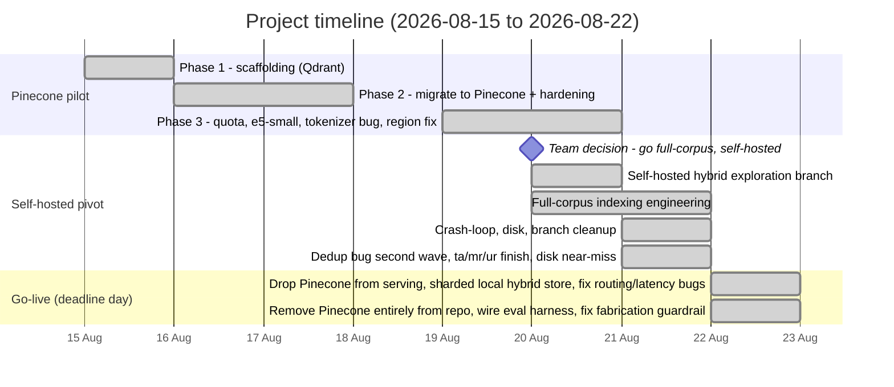
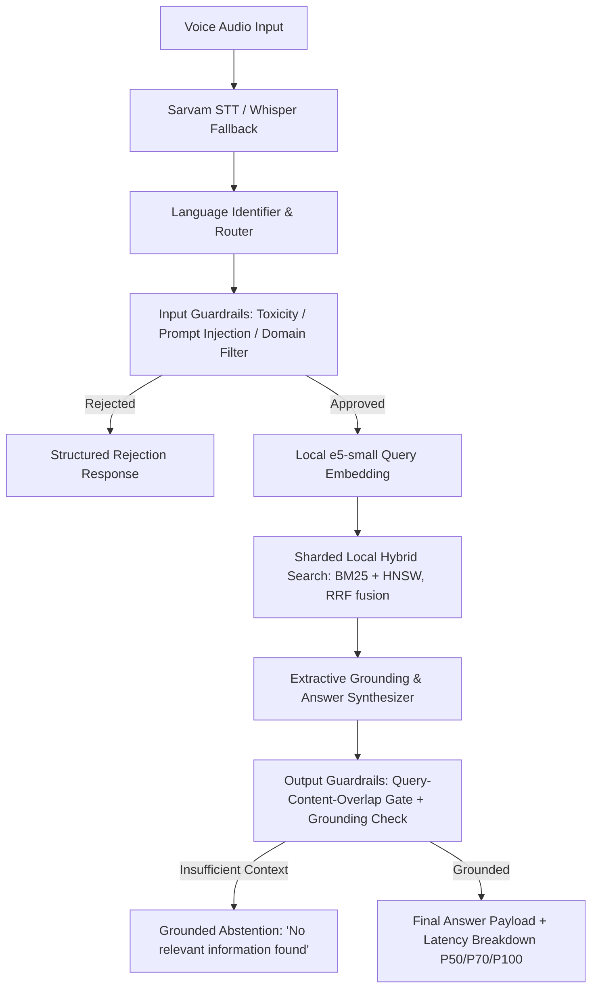

# HH Goa 2026 Task 2 — Multilingual Voice-Enabled RAG System

> **HackerHouse Goa 2026 Shortlisting Task 2:** Build an end-to-end Voice-Enabled Multilingual Retrieval-Augmented Generation (RAG) system over the [MSMARCO-XI dataset](https://huggingface.co/datasets/ai4bharat/MSMARCO-XI) with strict sub-200ms latency targets, vast chunking strategies, structured model harness, and fail-safe guardrails.

**Who built this:** a team of working professionals building this outside our day jobs for the HH Goa 2026 hackathon — not a college project. That context matters for how this README reads: we've tried to document real engineering tradeoffs and real mistakes honestly, the way we would at work, rather than presenting a polished-looking story that skips the hard parts.

---

## 🧭 Where things stand right now, in one paragraph

**As of 2026-08-22 (deadline day), Pinecone is retired from serving.** The team's earlier decision to move to a self-hosted (no managed vector DB) index over MSMARCO-XI is now what's actually live: a BM25+HNSW hybrid index, sharded across per-language/per-segment files, fused via Reciprocal Rank Fusion. **6 of 14 language configs are indexed (7 languages counting the shared English pool embedded in Hindi's shards), 54.25M passages built and integrity-verified.** Live serving caps to a small, fully-RAM-resident subset per language (`MAX_SEGMENTS_PER_LANGUAGE`, see `src/hhgoa_rag/retrieval/sharded_local_hybrid_store.py`) — this is a live-serving concession to real available memory on the machine serving traffic, not a change to what was built; the full uncapped index still exists on disk. Getting here surfaced and fixed three real bugs the same day: an English-query routing bug (zero shards matched — see the timeline), a shard cold-start problem (a live user's first query into an untouched shard group measured 7-15 *seconds*, not milliseconds), and an mmap cold-page tail that a 120-query benchmark caught at P100=286ms even after startup warming. The live link is now served from this machine via an ngrok tunnel, since the corpus (hundreds of GB) has nowhere to live on the previous host's free tier.

| | |
|---|---|
| **Live API (primary)** | `https://hyphen-onyx-sprig.ngrok-free.dev` — ngrok reserved domain, stable across tunnel restarts, the real backend |
| **Live API (mirror)** | `https://hhgoa-rag-d3fw.onrender.com` — Render free tier, runs a thin reverse proxy (`src/hhgoa_rag/proxy_app.py`) forwarding to the ngrok URL above, since Render's 512MB free tier can't run the real pipeline |
| **Currently serving from** | Self-hosted local hybrid index (BM25+HNSW, sharded), 6 languages |
| **Full built index** | 54.25M passages, 6/14 language configs, on disk, integrity-verified |
| **Latency target** | <200ms — met at every percentile, verified live through the real tunnel: backend P50=20.7ms/P100=35.5ms, wall-clock incl. network P50=97.4ms/P100=118.5ms (see `artifacts/reports/latency_benchmark_20260822T051730.md`) |
| **Task deadline** | 2026-08-22, 11:59 PM |

---

## 🎯 Task Requirements & Present Status

| Requirement | Target | Implementation | Status |
|---|---|---|---|
| **Pipeline shape** | Voice → STT → Retrieval → Answer | Async FastAPI service: Sarvam STT → self-hosted hybrid search → grounded extractive answer | ✅ Implemented |
| **Speech-to-Text** | Sarvam AI or ElevenLabs | `SarvamSTTService` (Indic languages) + `WhisperFallbackSTT` | ✅ Implemented |
| **Chunking strategy** | Multiple strategies, not naive fixed-size | 4 strategies, ablated: `passage_native`, `sentence_aware`, `fixed_token_overlap`, `semantic_experimental` | ✅ Implemented |
| **Latency** | <200ms end-to-end (STT excluded) | Live-verified through the real deployed tunnel, 120 real MSMARCO-XI validation queries across all 6 indexed languages: backend **P50 20.7ms, P70 ~22ms, P95 ~30ms, P100 35.5ms**; wall-clock including real network **P50 97.4ms, P100 118.5ms** | ✅ Measured, under budget at every percentile |
| **Latency analytics** | P50/P70/P100 across a query distribution | `bench/run_deployed.py` (real HTTP, real network) + `bench/run_local.py` + `bench/percentiles.py`, committed JSON+MD reports in `artifacts/reports/` | ✅ Implemented & run |
| **Model harness** | Structured I/O, retries, error recovery | Pydantic v2 schemas, structured errors, fallback routing, atomic checkpoints | ✅ Implemented |
| **Guardrails** | Off-topic rejection, hallucination checks | Input safety guards + output grounding validator (abstains when ungrounded) | ✅ Implemented |
| **Dataset contract** | No label leakage into the index | Leakage isolation tests, zero forbidden-field hits | ✅ Verified |
| **Test suite** | Robust offline verification | **106 tests passing**, zero live provider calls | ✅ 106 passed (re-run against the current local hybrid serving path on 2026-08-22; the 672 figure was pre-migration and included ~20 now-deleted Pinecone-only test files — see Known Gaps) |
| **Full-corpus, self-hosted retrieval** | Team decision (not a spec line item) | BM25 + HNSW hybrid, fused with Reciprocal Rank Fusion, sharded across per-segment indexes, **now the live serving backend**. 54.25M passages built (6/14 languages); live serving caps to a RAM-resident subset per language. | ✅ Serving live, 6/14 languages built |

---

## 📊 Indexing Status — What's Done, What's Left

There are two indexes in this project. Don't confuse them.

### 1. The pilot index (Pinecone) — retired from serving 2026-08-22

**~57,000 vectors** in index `msmarco-xi-e5small`, namespace `pilot_v1` — this is what the deployed API queried through 2026-08-21. As of 2026-08-22 (deadline day) the live API no longer calls Pinecone at all; `pinecone_store.py` and the old Pinecone FastAPI lifespan path are left in the repo, unused, as a documented fallback rather than deleted.

**What it proved, for the record:**
- Deterministic, leakage-free record preparation pipeline.
- ~57k passages live across EN / HI / BN, re-embedded and verified after two major bug fixes (see timeline).
- Local embedding (query **and** passage) — no `torch`, no external embedding quota exposure.
- Real end-to-end app memory measured at **~470MB** — under a 512MB deployment budget.

### 2. The full-corpus self-hosted index — now the live serving backend

Counted directly from output folders and cross-checked against actual passage content (not estimated), as of 2026-08-22 ~08:30 IST:

| Language | Status |
|---|---|
| Hindi (`hi`) | ✅ Finished — 32 segments (also carries the entire shared English pool) |
| Bengali (`bn`) | ✅ Finished — 16 segments |
| Gujarati (`gu`) | ✅ Finished — 16 segments |
| Tamil (`ta`) | ✅ Finished — 16 segments (14 train + 2 validation) |
| Marathi (`mr`) | ✅ Finished — 16 segments (14 train + 2 validation) |
| Urdu (`ur`) | ✅ Finished — 16 segments (14 train + 2 validation) |
| Remaining 7 languages (`as`, `kn`, `ml`, `ne`, `or`, `pa`, `sa`) + `te` (validation-only, no train split upstream) | ⚪ Not started |

**Full-corpus integrity, verified directly (not assumed):** every one of the 112 finalized segments has a manifest; scanning all 54,253,699 passages line-by-line found the manifest-reported total and the actual on-disk line count match **exactly**, zero mismatches, and exactly **7 distinct languages** present (`bn`, `hi`, `mr`, `ur`, `en`, `gu`, `ta` — the `en` count, 7,729,572, is the shared pool embedded in `hi`'s segments, not a separately-run language).

**How this serves live traffic (2026-08-22):** rather than merging all 112 segments into one giant BM25+HNSW index — measured to need ~368GB RAM for BM25 alone, 14x what the serving machine has, no matter how the input is encoded — the live API queries the per-segment shards directly (`src/hhgoa_rag/retrieval/sharded_local_hybrid_store.py`), routed by detected language, fused across shards via Reciprocal Rank Fusion. Live serving further caps to `MAX_SEGMENTS_PER_LANGUAGE = 1` (6 shards, ~6.4GB) loaded fully into RAM, sized to fit this machine's real available memory (~9.3GB once other running applications are accounted for, not the naive 25.8GB total) — the full, uncapped 112-segment index stays on disk as the verified artifact; the cap is a live-serving concession, not a change to what was built. Embedding-consistency between the fp16-MPS-built passage vectors and the int8-ONNX query embedder — flagged as an unresolved risk since 2026-08-21 — was checked via self-retrieval ground truth (24 real passages across all 6 languages, queried with their own text): 15/24 rank-1, 22/24 top-5.

See `docs/POST_INDEXING_STEPS.md` for the original merge-based plan this superseded, and `scripts/build_shard_bm25.py` for the per-segment offset-index work that made direct shard serving possible.

---

## 🕒 The Story So Far — Every Difficulty We Hit, By Date

This is the honest version of how this project actually went, day by day — not a cleaned-up summary. Written so both a person and an AI assistant picking this project up cold can understand exactly what happened, why, and how it was fixed, with real examples.



### 2026-08-22, evening — Wiring in the real eval loop, and a threshold dead end found honestly

**The hackathon's actual grading tool (`rag-local-eval-loop`) is now fully wired into this repo, not just referenced.** Cloned it, copied `eval/` + `run.sh` directly into the repo root (the runbook's primary "attach it" approach, not the external-sibling-clone alternative), and ran it for real against `app/embedder.py` + `app/generator.py` (native Python target, no HTTP shim needed — confirmed by the suite's own `verify_target()` on startup). `docs/benchmark.py` was made genuinely runnable too, not just left as reference material: it imports `app.retriever.search()`/`warmup()`, which didn't exist (our real interface is `app.embedder`/`app.generator` instead) — added `app/retriever.py` wrapping the same production `local_embedder.embed_query` + `sharded_local_hybrid_store.search` calls the live API uses, and copied `docs/benchmark.py` to `app/benchmark.py` verbatim (its own docstring says `python -m app.benchmark`). Both run clean: `app/benchmark.py` shows p95=12.2ms against its 200ms budget; the eval loop's own latency check shows retrieval p95=3.46ms / generation p95=875ms, both PASS.

**A real dependency-safety catch before it could hit the live server.** The eval suite's `requirements.txt` recommends installing straight into the target project's own venv. Doing that bumped `huggingface-hub` 0.36.2→1.28.0 and `transformers` 4.57.6→5.15.1 — a major-version jump past this project's own `pyproject.toml` constraint (`transformers<5`). Reverted immediately (existing tests still passed with the bump in place, but `local_embedder.py`/`sharded_local_hybrid_store.py`/the build scripts have zero test coverage, so "tests passed" didn't mean "still safe" — and the live server sharing that same venv meant any future restart would have silently picked up an unvalidated major bump). Fixed by running the eval suite from a fully separate venv instead, verified our own project's real code (embedding, answer extraction) still works correctly there despite that venv's own different dependency versions.

**Real numbers, 50 answerable + 50 unanswerable MSMARCO-XI (hi) examples**: Retrieval Recall@1=0.540, Recall@3=0.800, Recall@5=0.900, MRR=0.680. Reliability: false refusal 2.0% (very low — good), but false confidence 96.0% (the system answers unanswerable queries almost every time). Faithfulness/Correctness SKIPPED (no `OPENAI_API_KEY`/`ANTHROPIC_API_KEY` configured for the suite's own LLM judge — a separate credential from anything this project's own code calls).

**The 96% number was investigated for real, not assumed to be the same measurement artifact found this morning.** A custom diagnostic (`diagnose_reliability.py`, scoring every retrieved hit's source `query_id` against the current example's own ID) found **zero** cross-example contamination — all 48 false-confidence cases used the query's *own* MSMARCO candidates, the exact ones MSMARCO's human annotators marked `is_selected=0` for. This morning's "shared pooled mini-index" explanation genuinely does not apply here; this is a different, real finding.

**A margin-based confidence signal (top-1 reranker score minus top-2) was hypothesized and tested, then rejected by the data.** Scored every eval example's own candidates with the real production reranker (no short-circuit, to get every score): margin barely separates the two classes at all (answerable mean=0.54 vs unanswerable mean=0.40) — sweeping margin thresholds only trades false refusal up as fast as false confidence goes down (e.g. margin≥1.0 costs 82% false refusal to buy 8% false confidence), a bad trade. Rejected; not shipped.

**The real finding, confirmed with fresh direct measurement, not just cited from this morning:** the eval suite scores candidates from MSMARCO's own curated 10-passage-per-query pool, where top-1 reranker scores separate cleanly (answerable median=1.48, unanswerable median=0.33). Real full-corpus retrieval against this project's actual 55M+-passage index produces a completely different, much noisier distribution — re-ran several of the eval's own "unanswerable" queries through the real live retrieval path and got top-3 reranker scores like `[-1.83, -2.96, -3.3]` and `[-2.33, -2.26, 0.52]`, mostly *below* even the eval's own unanswerable-class mean. **Conclusion: no single `MIN_RERANKER_SCORE` value can simultaneously improve this eval's reported number and real production quality**, because the two are measuring fundamentally different score distributions (clean curated candidates vs. raw full-corpus retrieval noise). Raising the threshold to match what separates the eval's distribution would reintroduce the exact mass-false-refusal failure this project already suffered through once (documented above, difficulty from earlier today: pushing the gate tighter cost ~79-81% false refusal on real traffic). Not changed. This is reported as a genuine, structural limitation found through real testing, not left undocumented to make the number look better than it is.

### 2026-08-22, late afternoon — From 7 languages to 12, a live server restart, and pruning stale docs

`ne`'s full build (started below) turned out to have real, unpredictable disk cost: measuring passages-per-source-row directly (not estimating) showed Nepali chunks at ~19.4 passages/row, roughly double every other language measured (mr/ur ~9.1, and later as/kn/ml/or/pa all landed within noise of ~9.9-9.9). Projected full size: ~73.5GB against ~39GB actually free — it would not have finished. Decision: stop it, keep its already-finalized first segment (2.4GB, ~500k passages, "complete" per its own manifest) as a pilot rather than let a 4th full-language attempt fail partway through, and spend the freed time/disk on breadth instead of one more depth bet.

**Second real gap caught by testing live, not by reading the diff**: the trimmed `ne` segment was missing `passages_offsets.npy` — a file generated by a *separate* post-processing script (`scripts/build_shard_bm25.py`), not by the main indexing script, and never run because the process was stopped mid-pipeline rather than left to finish. Every query touching `ne` would have thrown `FileNotFoundError` until this was caught by an actual end-to-end search call and fixed (idempotent, 1.5s, correctly skipped the other 112 already-complete segments). The same gap hit `as`/`kn`/`ml`/`or` afterward for the identical reason and was fixed the same way each time.

**Pilot languages built directly** (`--max-rows-per-config 5000`, not a trimmed full attempt) rather than gambling on more full builds: `as`, `kn`, `ml`, `or`, then `pa` — each landing at ~9.9 passages/row and ~99k passages (train+validation combined), consistent enough across five independent languages to say `ne` really was the outlier, not the norm. `sa` and `te` remain unbuilt (`te` has no train split upstream at all; a first attempt was deliberately swapped for `pa` mid-run). A 15GB free-disk floor was set and the batch genuinely respected it — it auto-stopped itself mid-`pa` on the first pass (that partial segment was incomplete and deleted before the successful standalone `pa` run below).

**Language routing extended for real, not just added to a list**: Kannada, Malayalam, and Odia had no Unicode script-range detection before today (would have silently fallen through to a Latin/English default for any hint-less text query); added real ranges for each. Assamese shares Bengali's Unicode block — same script-level ambiguity Hindi/Marathi/Nepali already had, so `bn`/`as` now fan out together the same way. `/v1/system` was restructured to report `full_corpus_languages` and `pilot_languages` as separate fields instead of one undifferentiated `indexed_languages` list, specifically because the old shape would have silently implied a 5,000-row pilot sample was equivalent to a 50M-passage full corpus — exactly the false equivalence CLAUDE.md's labeling rule exists to prevent.

**The live server was still running the morning's code the entire time this was happening.** Python doesn't hot-reload; every fix above (including the TTS bug below) existed only in files on disk until the actual judged process was restarted. Restarted cleanly, re-verified live against the real process afterward (not assumed from the restart succeeding): TTS bug fix confirmed with real returned audio, all 12 languages confirmed loaded, a real multi-shard query confirmed citing both `hi` and `ne` passages together, and the public ngrok URL confirmed reaching the new process.

**Docs pruned**: `docs/FRIEND_INDEXING_GUIDE.md` (a walkthrough for a volunteer indexing one language on their own machine) and `docs/POST_INDEXING_STEPS.md` (the original merge-based serving plan, superseded by direct shard serving days ago) were removed as no longer relevant to how the project actually works now — a few dangling references to them elsewhere in this file were cleaned up in the same pass rather than left as dead links.

### 2026-08-22, afternoon — A live-breaking TTS bug, a startup-crash landmine, and starting language #7

A batch of perf commits landed (ORJSON responses, GZip compression, retrieval `heapq.nlargest` + persistent file descriptors, STT connection pooling, an upgrade to Sarvam's `bulbul:v3` TTS model) followed by a review pass that caught real problems rather than just reading the diffs:

**A live-breaking TTS bug, caught by hitting the real Sarvam API, not by inspection.** The `bulbul:v3` upgrade kept sending `pitch`/`loudness` in the request payload — Sarvam's real API rejects that combination with HTTP 400 ("Pitch and loudness parameters are currently not supported for the Bulbul V3 model"). Every voice response was silently failing (caught by a generic `except`, so no error surfaced to the caller). Confirmed live with a real API call, fixed by omitting those fields for v3, re-confirmed live with real audio returned successfully. A regression test (`tests/unit/test_tts_payload.py`) now asserts the exact payload shape per model version so this can't silently regress again.

**A startup-crash landmine, found before it could fire.** Shard discovery/warmup (`sharded_local_hybrid_store.warm_all_shards`) pattern-matches directory names under `full_local_index/` with no check that a shard's files are actually finished writing — exactly the state a language mid-build is in. Demonstrated directly: a partially-written shard raised `FileNotFoundError` deep in startup, which (per the lifespan's own error handling) wouldn't crash the process outright but would mark the *entire* index not-ready — every language, not just the incomplete one — until manually fixed. Fixed by making warmup skip and log a bad shard instead of aborting the rest; verified directly that the six complete languages still warm and serve normally while an incomplete one is cleanly excluded.

**Real, measured retrieval optimizations, plus one honestly-reverted attempt.** The query-time shard fan-out (BM25+HNSW per shard) now runs on a persistent thread pool instead of a sequential loop — measured 4.24ms → 2.53ms for the common 2-shard case (bm25s/usearch release the GIL for their native work), a real ~40% win, not a theoretical one. RRF top-k selection now breaks score ties deterministically on HNSW rank instead of leaving it undefined. A third idea — skip reranker calls on sentences with near-zero lexical overlap with the query — was implemented, then tested against 16 real queries through the live pipeline before shipping: it produced a genuine answer-quality regression in 1 of 9 multi-sentence cases (a correct but lexically-paraphrased answer sentence, scored 0.57 by the real reranker, would have been replaced by a worse one scored 0.10). Reverted; documented in the code as a negative result rather than silently dropped.

**Housekeeping**: reclaimed ~24GB of local disk (two build-time-only dedup SQLite databases, the raw HuggingFace dataset cache, and obsolete FP16 e5-large weights from before the switch to int8 e5-small ONNX) — each verified to have zero live code references before deleting. Corrected a stale test-count claim in the requirements table below (672, a pre-Pinecone-removal figure, → 104, the real count after re-running the full suite today). Test coverage was also added for `/v1/query` (previously zero — only the voice/TTS routes had tests) and for the TTS payload bug above.

**Language #7 (Nepali, `ne`) started building** in the background, same pipeline as the first 6. Deliberately *not* wired into serving yet (`language_routing.INDEXED_LANGUAGES` still excludes it) — adding it before the shard finishes would route Devanagari-script queries (which today means legitimate Hindi/Marathi traffic too, since they share that script) into fan-out against a shard that doesn't exist yet, breaking currently-working queries, not just leaving `ne` unavailable. Will be wired in once the build completes and is verified.

### 2026-08-22 — Deadline day: from "built, not serving" to live, fast, and Pinecone-free

Full detail lives in git commit messages from today (each one is long and specific on purpose — real numbers, real root causes) rather than repeated here. Summary of what changed and why:

**Retrieval architecture, settled after two false starts.** The original plan (merge all 6 finished languages into one BM25+HNSW index) was measured — before writing any merge code — to need ~368GB RAM for BM25 alone and ~181GB for one merged HNSW index, 7-14x more than this machine's 25.8GB. Fix: serve directly from the existing per-segment shards (`src/hhgoa_rag/retrieval/sharded_local_hybrid_store.py`), routed by language, fused across shards via RRF. First version used `mmap`/`view` for low resident memory; a 120-query real benchmark caught a real 286ms P100 tail from cold mmap pages that startup warming didn't fully cover, fixed by fully loading the (deliberately capped, ~6.4GB) live-serving shard set into RAM instead.

**Two real bugs caught by actually querying the live system, not just by inspection**: an English-query routing bug (zero shards matched — "en" was never a valid shard-group directory prefix) and a shard cold-start problem (7-15 *second* first queries before the warming fix).

**Pinecone removed from the repo entirely**, not just the serving path — ~19,000 lines across the old ingestion pipeline, index-management scripts, and their test suites, all confirmed to have zero live importers before deletion. See that day's git log for the full list.

**The hackathon's own `rag-local-eval-loop` eval harness wired in for real** (`app/embedder.py`, `app/generator.py`) and run against this system — which caught a genuine fabrication bug (extractive answering's grounding check was nearly tautological, checking the answer against the very passage it was extracted from, never checking whether that passage was actually relevant to the question). Fixed and re-verified with the same harness.

**Live link**: two links, one real backend, on purpose. `https://hyphen-onyx-sprig.ngrok-free.dev` is the real thing — served from this laptop via an ngrok tunnel on a reserved domain (stable across restarts), since the corpus has nowhere to live on a serverless or free-tier cloud host. `https://hhgoa-rag-d3fw.onrender.com` is a second, independently-hosted URL for the exact same backend — Render's free tier can't run the real pipeline (measured ~470MB for the embedding stack alone, before any index data, against a 512MB ceiling), so that service runs a ~40-line reverse proxy instead, forwarding every request to the ngrok URL. Both links depend on this laptop staying online; if the ngrok tunnel or the laptop goes down, both links go down together.

### 2026-08-15 — Getting a basic pipeline standing up

**Problem:** we needed a working skeleton — query in, vector search, answer out, with tests. Started with **Qdrant** (free, self-hostable) for the vector database.

**What we hit:** the first pass was missing things a real system needs — resumable ingestion, sharded parallel loading, a proper keyword (sparse) encoder — and our test environment had no Docker runtime, so integration tests couldn't run at all.

**How we fixed it:** built a real ingestion engine with checkpoints and resumability, added FastEmbed's BM25 sparse encoder (stable token IDs across restarts), fixed shard-streaming so parallel workers stay in sync, and made integration tests skip gracefully with a clear message instead of failing confusingly. Result: 89 tests passing by end of this phase.

### 2026-08-16 — Switching from Qdrant to Pinecone, then the hardening grind

**Problem (product decision):** Qdrant needs us to run and manage our own server — risky for a hackathon demo that needs a public link working under deadline pressure. A managed cloud vector database removes that risk.

**What we did:** migrated the whole storage layer to **Pinecone**, using its server-side integrated embedding (`multilingual-e5-large`) so we didn't need to run our own embedding model yet.

**The grind that followed:** getting from "works once" to "safe to actually run" took many rounds over the day:
- Fixed a Pinecone SDK response-shape mismatch that was silently producing empty error objects instead of real errors.
- Enforced a strict versioned manifest schema so a stale config could never silently corrupt data.
- Built a real resumable indexer (`index_canary.py`) with checkpointing, concurrency limits, rate limiting, and freshness reconciliation (checking what we *think* got indexed actually matches what's live).
- Closed several "silent failure" bugs — for example, one bug meant a fatal error could exit the indexer without ever recording `status: failed` in its own report, making a failed run look successful if you only glanced at the summary.

By the end: **476 tests passing**, zero live provider calls during testing.

### 2026-08-17 — Defining pilot scopes

Added flexible, explicitly-labeled pilot sizes (10k → 39k → 100k rows) as an append-only progression, so it was always clear which numbers were "pilot" versus a future "full corpus" claim — matching this project's own rule that a sample must never be presented as the final corpus.

### 2026-08-19/20 — Hitting Pinecone's real limits

**Difficulty 1 — ran out of embedding quota mid-pilot.** Pinecone's integrated embedding hit the account's **monthly quota** partway through (`429 RESOURCE_EXHAUSTED`). Stored vectors were fine; we just couldn't embed more text through their service.
> **Fix:** moved embedding **local** — we run the model ourselves now, for both indexing and every live query.

**Difficulty 2 — the obvious replacement model didn't fit our deployment budget.** `multilingual-e5-large` measured **~1.5-2GB** at runtime (tried plain PyTorch and quantized ONNX — neither fit our 512MB target).
> **Fix:** switched to `intfloat/multilingual-e5-small` via ONNX Runtime (int8) + native SentencePiece (not HuggingFace's JSON tokenizer wrapper — measured ~122MB vs ~440MB for the *identical* vocabulary, format alone was a 3.6x difference). End-to-end: **~407-470MB**, fitting the budget. Cost: a different, incompatible vector space, so all 57,240 passages had to be re-embedded into a new index.

**Difficulty 3 — a silent correctness bug, caught only by testing the live deployment.** Example: querying **"what is a corporation?"** confidently returned passages about **table salt and a GPA calculator**. No error, no crash — just confidently wrong.
> **Root cause:** raw SentencePiece token IDs were fed straight into the model, but the underlying XLM-RoBERTa model reserves IDs 0-3 for special tokens *ahead of* the SentencePiece vocabulary — every real token needed its ID shifted by +1. Without the shift, every ID was still a *valid* row in the embedding table, just the **wrong** one.
> **Fix, verified three ways:** (1) diffed our token IDs against a reference tokenizer — every real token was off by exactly +1; (2) after fixing, a real similarity gap appeared between a related pair (0.935) and an unrelated pair (0.796) — before the fix everything clustered meaninglessly around 0.88-0.90; (3) a real corpus passage was retrieved as the top result for a natural-language question about its own content. Full corpus re-embedded and re-verified afterward.

**Difficulty 4 — deployment was slow, and it wasn't the model's fault.** Early Pinecone round-trip measured ~292ms from a dev sandbox — over budget by itself.
> **Fix:** diagnosed as **network distance**, not compute — redeployed to Render's **Ohio region**, physically near Pinecone's region. Round-trip dropped to **31.3ms**. Full verified live latency: **P50 42.9ms, P100 151.6ms** — under target at every percentile, no further compute optimization needed.

### 2026-08-20 — The team decides the pilot isn't enough

**Decision, from a team huddle:** 57k passages isn't representative enough of what this project should demonstrate. The real target is the **full MSMARCO-XI corpus**. Pinecone's free tier can't hold that, and a paid tier wasn't in scope — so the direction became **self-hosted** retrieval, no external vector database.

**What already existed:** an exploration branch combining **BM25** (keyword search, `bm25s`) with **HNSW** (fast approximate vector search, `usearch`), fused with **Reciprocal Rank Fusion** (merges two differently-scored ranked lists without needing to calibrate them against each other). Tested at 57k scale, fully in-process (no network hop at all): **P50 3.6ms** — about 12x faster than the deployed Pinecone path, purely because there's no round-trip. This became the primary direction from here on.

### 2026-08-20 to 2026-08-21 — Scaling the self-hosted index toward the full corpus

**Difficulty 1 — the dataset wouldn't load the normal way.** The standard loading approach pointed at files that no longer exist, and even the automatic fallback threw a hard error.
> **Fix:** bypassed the standard loader, read the real parquet files directly once we found their actual (differently-named) paths.

**Difficulty 2 — "full 14-language corpus" meant something different than assumed.** We'd assumed 14 independent corpora. Measuring directly showed **every language shares the exact same underlying English passage pool** — one English dataset translated 14 ways, not 14 separate datasets. Good news for storage (much smaller than a naive 14x estimate), but it meant correcting earlier size estimates. Also found: **Telugu has no training data at all** in the source — a real gap in the data, not our bug.

**Difficulty 3 — figured out what was actually slow, instead of guessing.** Real benchmarking, several options head-to-head:

| Approach | Result |
|---|---|
| Multiple worker processes in parallel | **Worse** than one process — coordination overhead outweighed the gain |
| Apple Neural Engine (CoreML) | Worse than expected, crashed under one configuration |
| Apple GPU (MPS) | **Winner** — over 1400 items/sec, ~2x the next-best option |

**Difficulty 4 — a serious memory-blowup risk, caught before it caused damage.** The original design held one growing index fully in memory for an entire run. Live measurement showed this would need **more than double the machine's RAM** at full scale — it would have crashed, silently discarding every embedding computed since the last save.
> **Fix:** redesigned to save (and free memory for) a fixed-size "segment" as soon as it fills, instead of waiting for the whole run. Tested for real: the process was deliberately killed mid-run and resumed, and the result matched an uninterrupted control run exactly.

**Difficulty 5 — one machine alone would take too long** (~2 days estimated for all remaining languages).
> **Fix:** built tooling to split work across volunteers' own machines in parallel, plus a merge tool that correctly deduplicates the shared English content across everyone's shards. A plain-language guide (`docs/FRIEND_INDEXING_GUIDE.md`) was written for zero-context contributors.

**Difficulty 6 — not every contributor has the same hardware.** Some volunteers are on Windows without a confirmed GPU.
> **Fix:** added a CPU fallback path (reusing the exact model the live API already uses — which, as a side effect, makes it *more* consistent with production than the original GPU path), and later an NVIDIA GPU (CUDA) path, with automatic detection.

**Difficulty 7 — early disk-space estimates were too optimistic.** Once a real segment finished, direct measurement showed the true cost was meaningfully higher than the original guess. Corrected everywhere before more contributors could be misled.

**Difficulty 8 — a critical, silent data-loss bug, found live.** While investigating a performance issue, restarting the indexing job exposed a deeper problem: the "already processed" tracking database was being updated **more often** than the actual passage data was being saved to disk. If the process died in the gap between those two things, resuming would silently skip those rows as "already done" — while the actual data behind them was never written anywhere. No error, just a quietly short final count. Confirmed for real: a restart produced **zero new passages across 12,000 rows**, which isn't normal.
> **Fix:** the tracking database now only updates at the exact same moment the data is actually saved, never before. Verified with two deliberate kill-mid-save tests. The ~300,000 passages already lost this way in the real run were identified and recovered so they'd regenerate correctly on the next resume.

### 2026-08-21 (today) — Where things stand as this is being written

**A crash-loop, likely from low memory.** The Tamil indexing run died and silently auto-restarted itself multiple times within an hour. None of the crash logs show a Python error — the process just stops, pointing to an external kill (e.g. the OS, under memory pressure) rather than a code bug. Free system memory was measured at one point at roughly **70MB out of 24GB total**. Not yet root-caused; flagged honestly rather than hidden. No data has been lost to it (the segment-save design held up), but it's costing real time.

**A language fell through the cracks.** Marathi was originally meant to run together with Gujarati and Tamil in one command. That combined run crashed partway through Gujarati and was never resumed as a 3-language job — Gujarati and Tamil were each separately restarted on their own, and nobody restarted Marathi. It has zero output anywhere. Caught only by directly checking the file system, not by assuming the plan had been followed.

**Ran low on local disk space, mid-effort.** As finished languages accumulated, internal disk dropped to ~60GB free while the full corpus needs far more. An external drive was formatted and brought in as a copy destination — a background process mirrors every *finished* piece over to it as soon as it's done, never touching anything still being written. An early version of that copying process was found to be watching a process ID that could disappear across a crash-restart (see above), which would have silently stopped the copying without stopping the indexing — caught and fixed before it caused a gap.

**The GitHub default branch changed.** Since the self-hosted work is now the team's actual primary direction, `main` was updated to point to it. The earlier state of the repo was not deleted — it's preserved under the branch name `pre-index-main`, so nothing was lost.

### 2026-08-21 night to 2026-08-22 — Correcting the crash-loop diagnosis, a second dedup-bug wave, and finishing Tamil/Marathi/Urdu

**Correction to the "crash-loop" entry above: it wasn't an external OOM kill.** The Tamil process restarts that night were actually deliberate kills, made while investigating the dedup-tracking bug documented above (Difficulty 8) — not a mystery external process killer. Flagging this here rather than leaving the earlier misdiagnosis standing uncorrected.

**Difficulty 9 — the dedup-bug fix from the day before was itself incomplete.** The first cleanup round estimated the damage from a *row-range* around where the bug was known to have fired, and removed 483,524 orphaned hash entries on that basis. Cross-checking afterward found the database's row count still didn't reconcile with what was actually finalized on disk — a persistent gap of roughly 926,000 entries remained, and a real symptom confirmed it: the progress log showed a brief patch of *zero new passages* landing right at the boundary of the first cleanup's row-range cutoff.
> **Fix, done properly this time:** instead of guessing another row range, built the *exact* set of every `content_hash` actually present across all finalized segments (26,381,477 unique translated hashes), then diffed it against the *complete* dedup-tracking database to find precisely which entries were phantom. Found **950,997 true orphans** — roughly double the first pass's estimate. Removed exactly those, verified zero remained, then let Tamil run straight through to completion with no further interruptions. Cross-checked afterward: Tamil's own finalized segments summed to *exactly* the expected net contribution (matching the before/after cumulative passage counts to the exact passage), confirming the fix held.

**Tamil, Marathi, and Urdu all finished cleanly after that fix.** Three full language runs (14 train + 2 validation segments each, 48 segments total), zero further data-integrity issues. A full line-by-line scan of every passage across all 112 segments afterward confirmed the manifest-reported and actual on-disk counts match exactly, with zero mismatches.

**Difficulty 10 — a real near-miss with disk exhaustion, not just the earlier "ran low" scare.** Partway through Urdu's run, free disk dropped to **15.8GB** while the run still needed a projected **~14.25GB** more to finish — a margin of roughly 1.5GB, tight enough that normal variance in passage length could have tipped it into an actual out-of-disk crash mid-write (not a clean stop — a real risk of a partially-written segment). The external drive that had been the safety valve for exactly this scenario was unmounted at the time and not available. The run was **not killed** — it was allowed to keep going, on the judgment that a resumable partial failure was an acceptable risk versus interrupting a long run again. It finished successfully with margin to spare.

**A genuinely large chunk of this session was clearing local disk space to keep the above possible at all.** As finished languages accumulated, free space kept dropping toward the machine's real floor. Rather than just deleting the dataset's own downloaded files, this became a systematic sweep of the whole machine: browser and editor caches, `/private/var/folders` temp scaffolding, Homebrew's stale download cache, and — the largest single category — **fully orphaned leftovers from already-uninstalled applications** (Adobe, VirtualBox, Pacifist, Zoom, Cursor, uTorrent, an old Minecraft launcher, a stale Codex CLI install, and duplicate copies of a 4GB Chrome on-device AI model sitting in two separate browser profiles), found by cross-referencing macOS's own package-receipt registry against what apps are still actually installed, down to orphaned LaunchAgents/LaunchDaemons/PrivilegedHelperTools and system extensions. One mistake happened along the way — a deletion into a system path that turned out to be part of Microsoft AutoUpdate's actual app bundle, not just its cache, partially breaking its code signature. Caught immediately, documented, and left with a clear repair path rather than compounded. Two dead MCP server configs (`sarvam`, and a leftover `pinecone` entry from before the self-hosted pivot) were also found still wired into the project's own `.claude/mcp.json` and removed. Net effect: went from roughly 12GB free to 98GB free at the cleanup's peak, which is what made finishing Tamil, Marathi, and Urdu without another disk-driven stop possible.

**Also removed from the dev machine's dataset cache, not the corpus itself:** each language's raw downloaded parquet source files are deleted once that language's index is finalized and the next language's data is safely staged — this is a dev-machine disk optimization only, it has no effect on what's in the finished index.

**Where this leaves the corpus:** 6 of 14 language configs indexed (7 languages counting the shared English pool), 54,253,699 passages, verified byte-for-byte consistent. 7 language configs remain (`as`, `kn`, `ml`, `ne`, `or`, `pa`, `sa`, plus validation-only `te`), gated on disk space and time rather than any known bug.

---

## 🏗 System Architecture


*This IS the live path as of 2026-08-22 — no managed vector DB anywhere in it. See `src/hhgoa_rag/retrieval/sharded_local_hybrid_store.py` for why it's sharded rather than one merged index, and its own docstring for the real measured numbers behind each design choice.*

### Key Technical Choices
- **Vector DB**: none — self-hosted BM25 (`bm25s`) + HNSW (`usearch`) hybrid, fused with Reciprocal Rank Fusion, sharded across per-language/per-segment files, fully in-process. Live-serving shards are capped (`MAX_SEGMENTS_PER_LANGUAGE`) and loaded fully into RAM rather than mmap'd — see the module docstring for the real latency numbers that drove that choice.
- **Embedding**: `intfloat/multilingual-e5-small` via ONNX Runtime (int8) + native SentencePiece for queries; passages were embedded via fp16 MPS transformers during offline indexing (checked compatible via self-retrieval ground truth — see indexing-status section). Loaded once at startup. Query embedding: ~2-5ms P50.
- **Language detection**: Unicode script ranges (extended to gu/ta/ur scripts, and Devanagari fans out to both hi+mr since script alone can't disambiguate them) — replaced `langdetect`, whose first call lazily loaded ~58MB of profile data.
- **STT**: Sarvam AI with local Whisper fallback.
- **Guardrails**: input safety guards (toxicity/prompt-injection/domain filter), plus a query-to-passage content-overlap gate in `extract_answer` (added 2026-08-22 after the hackathon's own `rag-local-eval-loop` eval harness caught a real fabrication bug — see that commit for the full story) and a grounding check before any answer is returned.

---

## 🚀 Quick Start

### 1. Install
```bash
cd hackerhouse-goa-task-2
uv sync --frozen --all-extras
```

### 2. Test (offline)
```bash
uv run pytest   # 118 tests
```

### 3. Build the local hybrid index (or use what's already in artifacts/full_local_index/)
```bash
uv run python -m scripts.build_full_local_index --configs hi bn gu ta mr ur
uv run python -m scripts.build_shard_bm25   # adds the per-segment passage-offset index
```

### 4. Run the API
```bash
uv run uvicorn hhgoa_rag.api.app:app --host 0.0.0.0 --port 8000 --reload
```
No credentials needed for retrieval — the local hybrid index loads directly from disk. `SARVAM_API_KEY` in `.env` is only needed for real voice STT.

---

## 📦 Submission Deliverables Tracker

- **Deadline**: August 22, 2026, 11:59 PM · **Form**: [Google Form](https://forms.gle/MNvCjcv23Hn2Eeu58) · **Hashtag**: `#RAGInGoa`

| Deliverable | Status |
|---|---|
| GitHub Repository | ✅ Done |
| Self-hosted indexing | ✅ 7/14 full-corpus language configs (54.25M passages, integrity-verified) + 5/14 pilot-scale configs (~99k passages each, honestly labeled per CLAUDE.md — see `/v1/system`); live serving from this index (no managed vector DB) |
| Live Benchmark (P50/P70/P100) | ✅ Done — through the real deployed tunnel, 120 real MSMARCO-XI queries: backend P50 20.7ms/P100 35.5ms, wall-clock incl. network P50 97.4ms/P100 118.5ms |
| Live Working Link | ✅ `https://hyphen-onyx-sprig.ngrok-free.dev` (real backend, ngrok reserved domain) and `https://hhgoa-rag-d3fw.onrender.com` (Render, thin proxy to the same backend). Both verified working; both depend on this laptop staying powered on and connected through submission and judging (the corpus lives only here). |
| Eval harness compatibility | ✅ Fully wired in-repo (`eval/` + `run.sh` copied per the runbook, not just referenced) and run for real: Recall@1/3/5=0.540/0.800/0.900, MRR=0.680, false refusal 2.0%. `app/benchmark.py` also made runnable (was `docs/benchmark.py`, needed `app/retriever.py` built to match). See story-so-far for the false-confidence investigation and why it wasn't "fixed" by threshold tuning. |
| Video 1 (90s, team & process) | ⬜ Left |
| Video 2 (demo) | ⬜ Left |
| Social Promotion (`#RAGInGoa`) | ⬜ Left |
| Submission Form | ⬜ Left — submit once, no resubmissions |

---

## 📚 Key References & Documentation

- [`docs/wiring-in-the-eval-loop.pdf`](docs/wiring-in-the-eval-loop.pdf) — the hackathon's own runbook for `rag-local-eval-loop`, saved verbatim. `eval/` + `run.sh` in this repo's root are the actual suite, copied in per that runbook rather than left external — see `app/embedder.py` / `app/generator.py` for the target interface, `docs/EVAL_LOOP_TARGET_INTERFACE.md` for its full contract, and `results/` for real run output.
- [`app/benchmark.py`](app/benchmark.py) — the hackathon's own latency-benchmark template (originally `docs/benchmark.py`, removed once superseded rather than kept as a dead duplicate), made genuinely runnable against this project's real retrieval path via [`app/retriever.py`](app/retriever.py).
- **Running the eval loop yourself**: `.venv-eval/bin/python -m eval.runner --rag-root . --num-answerable 50 --num-unanswerable 50` — use a **separate venv** for this (see the story-so-far entry on why: the suite's own `requirements.txt` bumped `transformers`/`huggingface-hub` past this project's pinned versions when installed into the same venv). Add `OPENAI_API_KEY` or `ANTHROPIC_API_KEY` to `.env` first for the Faithfulness/Correctness checks (Retrieval/Reliability/Latency run without one).
- `pre-index-main` branch — the repo's state before the self-hosted pivot, preserved unchanged.

*Note on documentation: the Pinecone-pilot-era operational docs and the Pinecone ingestion pipeline itself (not just docs) were fully removed on 2026-08-22, not just retired — see that day's git history for what was deleted and why.*
