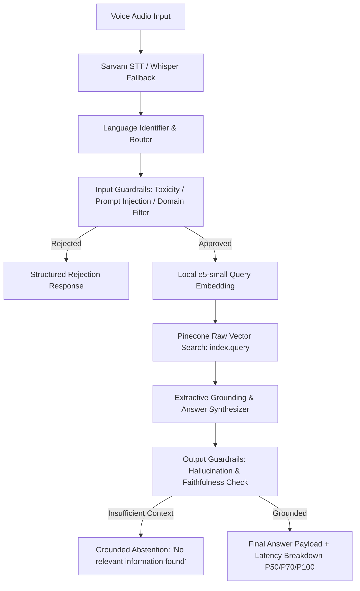

# HH Goa 2026 Task 2 — Multilingual Voice-Enabled RAG System

> **HackerHouse Goa 2026 Shortlisting Task 2:** Build an end-to-end Voice-Enabled Multilingual Retrieval-Augmented Generation (RAG) system over the [MSMARCO-XI dataset](https://huggingface.co/datasets/ai4bharat/MSMARCO-XI) with strict sub-200ms latency targets, vast chunking strategies, structured model harness, and fail-safe guardrails.

---

## 🎯 Task 2 Requirements & Present Project Status

| Task 2 Requirement (`task 2_ hhg.pdf`) | Specification & Target | Project Implementation & Present Status | Status |
|---|---|---|---|
| **1. Pipeline Shape** | Voice Input → STT → Chunking/Retrieval → Answer Generation | End-to-end async FastAPI service orchestrating Sarvam STT, Pinecone vector search, reranking, and grounded extractive answer synthesis. | **IMPLEMENTED** |
| **2. Speech-to-Text** | Sarvam AI or ElevenLabs (Voice-to-Text) | [`SarvamSTTService`](file:///Users/suvra/Documents/hackerhouse-goa-task-2/src/hhgoa_rag/stt/sarvam.py) with regional Indic language support + [`WhisperFallbackSTT`](file:///Users/suvra/Documents/hackerhouse-goa-task-2/src/hhgoa_rag/stt/whisper_fallback.py) error recovery. | **IMPLEMENTED** |
| **3. Chunking Strategy** | Vast exploration (not single naive fixed-size); multiple strategies, overlap, semantic & metadata-aware splitting | 4 distinct chunking strategies implemented & ablated in [`src/hhgoa_rag/ingestion/chunkers.py`](file:///Users/suvra/Documents/hackerhouse-goa-task-2/src/hhgoa_rag/ingestion/chunkers.py): `passage_native`, `sentence_aware`, `fixed_token_overlap`, and `semantic_experimental`. | **IMPLEMENTED** |
| **4. Latency Target** | Full pipeline through to final answer under **200 ms** | **Verified live against the deployed Render instance** (`https://hhgoa-rag-d3fw.onrender.com`, Ohio region), **100 real queries**, server-side pipeline time (`total_backend_ms`, i.e. STT-excluded end-to-end processing — chunking is offline, per CLAUDE.md): **P50 42.4ms, P70 72.3ms, P95 103.4ms, P99/P100 170.2ms** — under budget at every percentile, including the tail. Deploying in Render's Ohio region (near Pinecone's `aws/us-east-1`) cut the Pinecone round-trip from ~292ms (measured pre-deploy, from a dev sandbox far from that region) to ~31ms, confirming the earlier network-bound diagnosis was correct and fixable by region placement alone. A separate fix moved local-embedder warmup into server startup (was happening on the first real request — a redeploy-triggered cold load once measured at 9.3s for one unlucky query; now absorbed before traffic is served). See `artifacts/reports/latency_benchmark_20260819T222240.{json,md}`. | **MEASURED — UNDER 200ms AT EVERY PERCENTILE (n=100)** |
| **5. Latency Analytics** | P50 / P70 / P100 latency measured across test query distribution | `bench/run_local.py` fires real queries (from the MSMARCO-XI validation split, disjoint from the indexed train split) through the full live pipeline in-process, `bench/percentiles.py` computes percentiles, `bench/report.py` writes a committed JSON+MD report. | **IMPLEMENTED & RUN** |
| **6. Model Harness** | Structured orchestration (tool calls, retries, structured I/O, error recovery) | Pydantic v2 I/O schemas, structured error envelopes, fallback routing, deterministic UUIDv5 passage ID verification, and atomic indexing checkpoints. | **IMPLEMENTED** |
| **7. Guardrails** | Off-topic rejection, input safety, hallucination checks, grounded answers (knows when *not* to answer) | Input safety guards ([`input_guards.py`](file:///Users/suvra/Documents/hackerhouse-goa-task-2/src/hhgoa_rag/guardrails/input_guards.py)) + output grounding validator ([`grounding.py`](file:///Users/suvra/Documents/hackerhouse-goa-task-2/src/hhgoa_rag/answer/grounding.py)) that abstains on ungrounded context. | **IMPLEMENTED** |
| **8. Dataset Contract** | Grounding on MSMARCO-XI dataset without data leakage | Leakage isolation tests ([`test_leakage.py`](file:///Users/suvra/Documents/hackerhouse-goa-task-2/tests/contract/test_leakage.py)) ensuring query/answer labels are stripped during indexing. | **VERIFIED** |
| **9. Test & Reliability Suite** | Robust offline verification without flaky external dependencies | **672 passed unit, contract, and behavioural tests** in offline mode with zero live provider calls. | **672 PASSED** |

---

## 📊 Indexing Status — What's Done, What's Left

**~57,000 vectors are confirmed live in Pinecone right now** (index `msmarco-xi-e5small`, namespace `pilot_v1`), verified directly against the provider via `describe_index_stats()` — not inferred from local files. This is a pilot-scale corpus, clearly labeled as such per [`CLAUDE.md`](CLAUDE.md); it is not the full MSMARCO-XI corpus.

**Why a second index exists**: the original 57,240 passages were embedded through Pinecone's server-side integrated `multilingual-e5-large`. That hit the account's monthly embedding-token quota mid-pilot (429 `RESOURCE_EXHAUSTED`) and, once query embedding moved local to escape that, e5-large's own runtime footprint (~1.5-2GB measured across both torch and ONNX Runtime, quantized or not) didn't fit a 512MB free-tier deployment target. `intfloat/multilingual-e5-small` (ONNX int8, raw SentencePiece) measured **~407-470MB end-to-end**, and is the model now serving both indexing and querying — but it produces a different, incompatible vector space (384-dim vs. 1024-dim), so all 57,240 passages were re-embedded and re-upserted into a new index (`scripts/reindex_e5small.py`, source text pulled from the live index's own metadata — not re-downloaded from HuggingFace). The original `msmarco-xi` (e5-large) index is untouched and still exists.

**Done:**
- Deterministic, leakage-free record preparation pipeline (offline, seeded, reproducible).
- ~57k passages indexed and live in Pinecone across EN / HI / BN.
- Full corpus re-embedded with e5-small and migrated to a new dimension-matched index — 57,240/57,240 verified, ~12 minutes wall-clock (8 parallel workers), report in `artifacts/reports/reindex_e5small_*.json`.
- Local embedding (query **and** passage) via ONNX Runtime + native SentencePiece — no `torch`, no Pinecone-hosted embedding dependency, no monthly quota exposure. Real memory measured at each step, not estimated (see `src/hhgoa_rag/retrieval/local_embedder.py` module docstring for the full measurement trail, including two dead ends: e5-large was tried quantized under both torch and ONNX Runtime and neither fit).
- Real end-to-end app memory measured at **~470MB** steady-state (FastAPI + Pinecone client + embedder + guardrails, 21 real mixed-language queries) — under Render's 512MB free tier with working margin.
- **A critical correctness bug was found and fixed post-deploy**: raw `sentencepiece.encode()` piece ids were used directly as model input without XLM-RoBERTa's required "fairseq offset" (+1 to every id — ids 0-3 are reserved for special tokens ahead of the SentencePiece vocabulary). Every id was still a *valid* embedding-table row, just the wrong one, so it produced no error — only semantically scrambled embeddings for every query and all 57,240 passages. Caught by testing the live deployment ("what is a corporation?" confidently returned passages about table salt). Root cause confirmed by diffing token ids against `transformers.AutoTokenizer`'s reference output (every id off by exactly +1); fix verified three ways — exact id match, a real similarity gap on a related/unrelated pair (0.935 vs 0.796, versus ~0.88-0.90 for everything beforehand), and a ground-truth self-retrieval test (a real corpus passage retrieved as top hit for a natural-language question about its own content). Full corpus re-embedded and re-verified after the fix.

**Left / blocked:**
- Retrieval quality has been spot-checked (ground-truth self-retrieval, related/unrelated similarity gap) but not run through a systematic quality eval (e.g. MRR@k against a held-out query set) — spot checks confirm the pipeline is *correct*, not a measured quality number.
- Further growth toward a larger pilot corpus is not scheduled.
- Full MSMARCO-XI corpus (~24.87M vectors, ~171.67 GB extrapolated) has not been started and requires a dedicated production Pinecone tier — out of scope for this submission window.

---

## 🏗 System Architecture



### Key Technical Choices
- **Vector DB**: Pinecone Serverless, raw vector storage/search (384-dim, cosine metric, index `msmarco-xi-e5small`) — not Pinecone's integrated embedding (see below).
- **Embedding (query and passage)**: `intfloat/multilingual-e5-small` via **ONNX Runtime** (`onnx/model_int8.onnx`) + **native SentencePiece** (not HuggingFace's `tokenizers` JSON wrapper). Loaded once at process startup, not per-request. Real end-to-end app memory measured at **~470MB** (FastAPI + Pinecone client + embedder + guardrails together, not the embedder alone). Query embedding itself: **5.3ms P50**.
  - **Why not Pinecone's integrated embedding**: hit the account's monthly embedding-token quota (429 `RESOURCE_EXHAUSTED`) during pilot indexing — the stored vectors were unaffected, only Pinecone's own embedding service was capped.
  - **Why not `torch` + `transformers` + e5-large** (tried first): measured ~1.5-2GB steady-state regardless of int8 quantization (tried both a custom torch quantizer and ONNX Runtime — neither fit a 512MB container; embedding-table quantization, `inplace=True` deep-copy avoidance, and ONNX arena/graph-opt tuning were all tried and measured, not assumed).
  - **Why ONNX + native SentencePiece over `transformers.AutoTokenizer`**: identical 250k-token XLM-RoBERTa vocabulary measured ~440MB via the JSON-based `tokenizers` wrapper vs. ~122MB via `sentencepiece.SentencePieceProcessor` — same data, ~3.6x difference from format alone.
  - Full measurement trail, numbers, and dead ends are documented in `src/hhgoa_rag/retrieval/local_embedder.py`'s module docstring.
- **Language detection**: Unicode script ranges (Devanagari → hi, Bengali → bn, else → en) — replaced `langdetect`, whose first real call lazily loaded ~58MB of language-profile data (measured; this alone was the difference between fitting and not fitting under 512MB).
- **Reranker**: `bge-reranker-v2-m3` via Pinecone inference API for cross-lingual precision.
- **STT Engine**: Sarvam AI API for Indic speech recognition with local Whisper fallback.
- **Guardrail Layer**: Strict token-limit enforcement, regex-based adversarial input rejection, and token overlap/containment grounding verification.

---

## 🚀 Quick Start

### 1. Installation & Environment
```bash
# Clone and enter directory
cd hackerhouse-goa-task-2

# Install locked dependencies with uv
uv sync --frozen --all-extras
```

### 2. Run Test Suite (Offline)
```bash
# Run all 672 unit, contract, and behavioural tests
uv run pytest
```

### 3. Prepare & Index Canary / Pilot Data
```bash
# Step 1: Prepare deterministic records (offline)
uv run python scripts/prepare_canary.py \
    --scope canary-300 \
    --dataset-revision bf5cdc1f26e581e519018e434db14edd1b77602b \
    --tokenizer-revision 3d7cfbdacd47fdda877c5cd8a79fbcc4f2a574f3 \
    --seed 42

# Step 2: Index records into Pinecone
export PINECONE_API_KEY="your-api-key"
CONFIRM_PINECONE_WRITE=1 uv run python scripts/index_canary.py \
    --scope canary-300 \
    --manifest artifacts/prepared/canary-42-ee540c17772a_manifest.json \
    --execute --resume --concurrency 4
```

### 4. Start the RAG API Server
```bash
uv run uvicorn hhgoa_rag.api.app:app --host 0.0.0.0 --port 8000 --reload
```

---

## 📦 Submission Deliverables Tracker

- **Task Launch**: August 13, 2026
- **Task Deadline**: August 22, 2026, 11:59 PM
- **Submission Form**: [Google Form](https://forms.gle/MNvCjcv23Hn2Eeu58)
- **Mandatory Hashtag**: `#RAGInGoa` (Instagram, X, LinkedIn)

| Deliverable | Requirement | Status |
|---|---|---|
| **GitHub Repository** | Full codebase, tests, documentation, reproducible runbooks | **Done** |
| **Pilot Indexing** | Real data live in Pinecone for demo/benchmark use | **Done — ~57k vectors live**; further growth blocked (see Indexing Status above) |
| **Live Benchmark (P50/P70/P100)** | Latency numbers from a real run, not best-case | **Done — server-side P50 42.4ms / P70 72.3ms / P95 103.4ms / P99/P100 170.2ms** (n=100), under the 200ms target at every percentile, measured against the live deployment; committed in `artifacts/reports/` |
| **Live Working Link** | Deployed working API / Demo endpoint | **Done — `https://hhgoa-rag-d3fw.onrender.com`** (Render free tier, Ohio region; spins down after ~15min idle, first request after that pays a ~30-50s cold start) |
| **Video 1 (90s)** | Team & development process video | **Left** |
| **Video 2 (Demo)** | End-to-end working product demonstration | **Left** |
| **Social Promotion** | Individual team member posts across Instagram, X, LinkedIn, tagged `#RAGInGoa` | **Left** |
| **Submission Form** | https://forms.gle/MNvCjcv23Hn2Eeu58 | **Left** — submit only once, no resubmissions |

---

## 📚 Key References & Documentation

- [`docs/INGESTION_RUNBOOK.md`](file:///Users/suvra/Documents/hackerhouse-goa-task-2/docs/INGESTION_RUNBOOK.md) — Live indexing & operations runbook.
- [`docs/PINECONE_SCHEMA.md`](file:///Users/suvra/Documents/hackerhouse-goa-task-2/docs/PINECONE_SCHEMA.md) — Canonical vector and payload schema.
- [`docs/DATASET_CONTRACT.md`](file:///Users/suvra/Documents/hackerhouse-goa-task-2/docs/DATASET_CONTRACT.md) — Dataset leakage boundary definitions.
- [`docs/FINAL_PREINDEX_READINESS_REPORT.md`](file:///Users/suvra/Documents/hackerhouse-goa-task-2/docs/FINAL_PREINDEX_READINESS_REPORT.md) — Pre-index hardening verification report.
