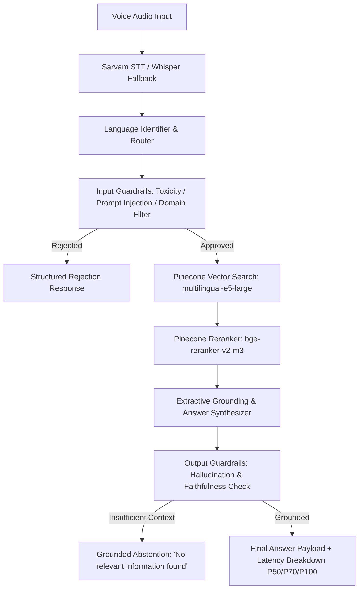

# HH Goa 2026 Task 2 — Multilingual Voice-Enabled RAG System

> **HackerHouse Goa 2026 Shortlisting Task 2:** Build an end-to-end Voice-Enabled Multilingual Retrieval-Augmented Generation (RAG) system over the [MSMARCO-XI dataset](https://huggingface.co/datasets/ai4bharat/MSMARCO-XI) with strict sub-200ms latency targets, vast chunking strategies, structured model harness, and fail-safe guardrails.

---

## 🎯 Task 2 Requirements & Present Project Status

| Task 2 Requirement (`task 2_ hhg.pdf`) | Specification & Target | Project Implementation & Present Status | Status |
|---|---|---|---|
| **1. Pipeline Shape** | Voice Input → STT → Chunking/Retrieval → Answer Generation | End-to-end async FastAPI service orchestrating Sarvam STT, Pinecone vector search, reranking, and grounded extractive answer synthesis. | **IMPLEMENTED** |
| **2. Speech-to-Text** | Sarvam AI or ElevenLabs (Voice-to-Text) | [`SarvamSTTService`](file:///Users/suvra/Documents/hackerhouse-goa-task-2/src/hhgoa_rag/stt/sarvam.py) with regional Indic language support + [`WhisperFallbackSTT`](file:///Users/suvra/Documents/hackerhouse-goa-task-2/src/hhgoa_rag/stt/whisper_fallback.py) error recovery. | **IMPLEMENTED** |
| **3. Chunking Strategy** | Vast exploration (not single naive fixed-size); multiple strategies, overlap, semantic & metadata-aware splitting | 4 distinct chunking strategies implemented & ablated in [`src/hhgoa_rag/ingestion/chunkers.py`](file:///Users/suvra/Documents/hackerhouse-goa-task-2/src/hhgoa_rag/ingestion/chunkers.py): `passage_native`, `sentence_aware`, `fixed_token_overlap`, and `semantic_experimental`. | **IMPLEMENTED** |
| **4. Latency Target** | Full pipeline through to final answer under **200 ms** | Server-side integrated embeddings (`multilingual-e5-large`), sub-millisecond route guards, lightweight extractive grounding. Live benchmark validation underway. | **OPTIMIZED / IN VALIDATION** |
| **5. Latency Analytics** | P50 / P70 / P100 latency measured across test query distribution | Observability timers ([`timing.py`](file:///Users/suvra/Documents/hackerhouse-goa-task-2/src/hhgoa_rag/observability/timing.py)) tracking STT, vector search, reranking, and generation percentiles ([`percentiles.py`](file:///Users/suvra/Documents/hackerhouse-goa-task-2/bench/percentiles.py)). | **IMPLEMENTED** |
| **6. Model Harness** | Structured orchestration (tool calls, retries, structured I/O, error recovery) | Pydantic v2 I/O schemas, structured error envelopes, fallback routing, deterministic UUIDv5 passage ID verification, and atomic indexing checkpoints. | **IMPLEMENTED** |
| **7. Guardrails** | Off-topic rejection, input safety, hallucination checks, grounded answers (knows when *not* to answer) | Input safety guards ([`input_guards.py`](file:///Users/suvra/Documents/hackerhouse-goa-task-2/src/hhgoa_rag/guardrails/input_guards.py)) + output grounding validator ([`grounding.py`](file:///Users/suvra/Documents/hackerhouse-goa-task-2/src/hhgoa_rag/answer/grounding.py)) that abstains on ungrounded context. | **IMPLEMENTED** |
| **8. Dataset Contract** | Grounding on MSMARCO-XI dataset without data leakage | Leakage isolation tests ([`test_leakage.py`](file:///Users/suvra/Documents/hackerhouse-goa-task-2/tests/contract/test_leakage.py)) ensuring query/answer labels are stripped during indexing. | **VERIFIED** |
| **9. Test & Reliability Suite** | Robust offline verification without flaky external dependencies | **672 passed unit, contract, and behavioural tests** in offline mode with zero live provider calls. | **672 PASSED** |

---

## 📊 Indexing & Capacity Progression

| Scope | Record Count / Language Quota | Purpose | Indexing Pipeline Status |
|---|---|---|---|
| **Canary-300** | 300 records (100 EN / 100 HI / 100 BN) | Fail-closed preflight, exact ID verification, resume test | **Ready & Verified** |
| **Pilot-10000** | 10,000 records (3,334 EN / 3,333 HI / 3,333 BN) | Pinecone Starter tier capacity validation | **Ready & Configured** |
| **Pilot-39000** | 39,000 records (13,000 EN / 13,000 HI / 13,000 BN) | Extended multi-language pilot representation | **Ready & Configured** |
| **Full Corpus** | ~24.87M vectors (~171.67 GB extrapolated) | Full multi-Indic corpus scale | *Requires dedicated production tier* |

---

## 🏗 System Architecture



### Key Technical Choices
- **Vector DB & Embedding**: Pinecone Serverless with integrated `multilingual-e5-large` (1024-dim, cosine metric, text field mapping).
- **Reranker**: `bge-reranker-v2-m3` via Pinecone inference API for cross-lingual precision.
- **STT Engine**: Sarvam AI API for Indic speech recognition with local Whisper fallback.
- **Guardrail Layer**: Strict token-limit enforcement, regex-based adversarial input rejection, and token overlap/containment grounding verification.

---

## 🚀 Quick Start

### 1. Installation & Environment
```bash
# Clone and enter directory
cd hackerhouse-goa-task-2

# Install locked dependencies with uv
uv sync --frozen --all-extras
```

### 2. Run Test Suite (Offline)
```bash
# Run all 672 unit, contract, and behavioural tests
uv run pytest
```

### 3. Prepare & Index Canary / Pilot Data
```bash
# Step 1: Prepare deterministic records (offline)
uv run python scripts/prepare_canary.py \
    --scope canary-300 \
    --dataset-revision bf5cdc1f26e581e519018e434db14edd1b77602b \
    --tokenizer-revision 3d7cfbdacd47fdda877c5cd8a79fbcc4f2a574f3 \
    --seed 42

# Step 2: Index records into Pinecone
export PINECONE_API_KEY="your-api-key"
CONFIRM_PINECONE_WRITE=1 uv run python scripts/index_canary.py \
    --scope canary-300 \
    --manifest artifacts/prepared/canary-42-ee540c17772a_manifest.json \
    --execute --resume --concurrency 4
```

### 4. Start the RAG API Server
```bash
uv run uvicorn hhgoa_rag.api.app:app --host 0.0.0.0 --port 8000 --reload
```

---

## 📦 Submission Deliverables Tracker

- **Task Launch**: August 13, 2026
- **Task Deadline**: August 22, 2026, 11:59 PM
- **Submission Form**: [Google Form](https://forms.gle/MNvCjcv23Hn2Eeu58)
- **Mandatory Hashtag**: `#RAGInGoa` (Instagram, X, LinkedIn)

| Deliverable | Requirement | Status |
|---|---|---|
| **GitHub Repository** | Full codebase, tests, documentation, reproducible runbooks | **Complete** |
| **Live Working Link** | Deployed working API / Demo endpoint | In Progress |
| **Video 1 (90s)** | Team & development process video | In Preparation |
| **Video 2 (Demo)** | End-to-end working product demonstration | In Preparation |
| **Social Promotion** | Individual team member posts across Instagram, X, LinkedIn | Scheduled for submission |

---

## 📚 Key References & Documentation

- [`docs/INGESTION_RUNBOOK.md`](file:///Users/suvra/Documents/hackerhouse-goa-task-2/docs/INGESTION_RUNBOOK.md) — Live indexing & operations runbook.
- [`docs/PINECONE_SCHEMA.md`](file:///Users/suvra/Documents/hackerhouse-goa-task-2/docs/PINECONE_SCHEMA.md) — Canonical vector and payload schema.
- [`docs/DATASET_CONTRACT.md`](file:///Users/suvra/Documents/hackerhouse-goa-task-2/docs/DATASET_CONTRACT.md) — Dataset leakage boundary definitions.
- [`docs/FINAL_PREINDEX_READINESS_REPORT.md`](file:///Users/suvra/Documents/hackerhouse-goa-task-2/docs/FINAL_PREINDEX_READINESS_REPORT.md) — Pre-index hardening verification report.
