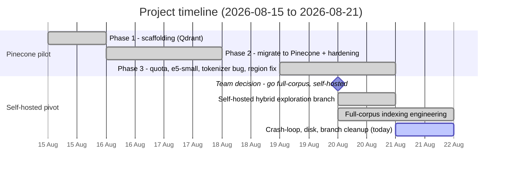
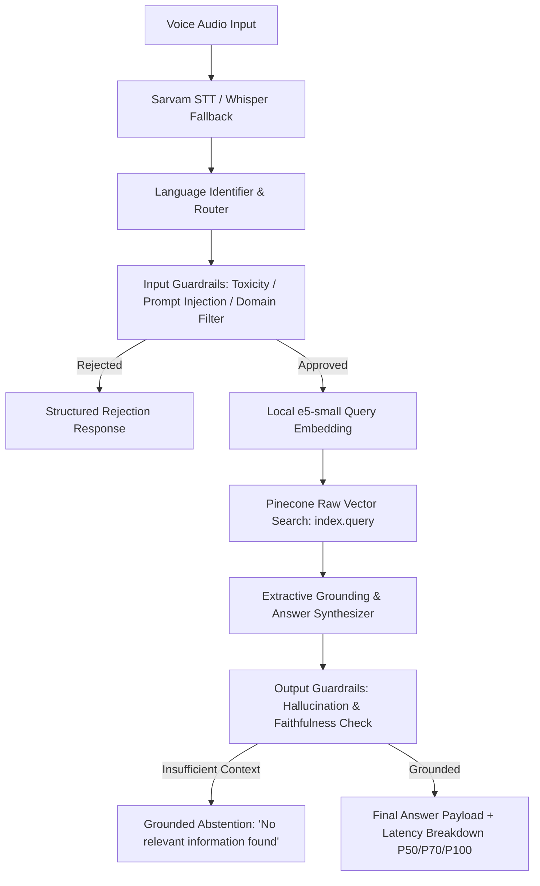

# HH Goa 2026 Task 2 — Multilingual Voice-Enabled RAG System

> **HackerHouse Goa 2026 Shortlisting Task 2:** Build an end-to-end Voice-Enabled Multilingual Retrieval-Augmented Generation (RAG) system over the [MSMARCO-XI dataset](https://huggingface.co/datasets/ai4bharat/MSMARCO-XI) with strict sub-200ms latency targets, vast chunking strategies, structured model harness, and fail-safe guardrails.

**Who built this:** a team of working professionals building this outside our day jobs for the HH Goa 2026 hackathon — not a college project. That context matters for how this README reads: we've tried to document real engineering tradeoffs and real mistakes honestly, the way we would at work, rather than presenting a polished-looking story that skips the hard parts.

---

## 🧭 Where things stand right now, in one paragraph

There are **two separate things** in this repo — don't mix them up. First, a **working, deployed product**: a live API serving queries over a ~57,000-passage pilot corpus through Pinecone, verified under the 200ms latency target. This is what's actually running at `https://hhgoa-rag-d3fw.onrender.com` right now (checked moments before writing this: **HTTP 200, healthy**). Second, a **much bigger, still-in-progress effort**: building a self-hosted (no Pinecone) search index over the *entire* MSMARCO-XI dataset, across many Indian languages, because the team decided the 57k pilot wasn't enough and Pinecone's free tier can't hold the full corpus anyway. That second effort is real, making real progress, and also currently mid-way through some real problems (see the timeline below) — it is **not yet plugged into the live API**.

| | |
|---|---|
| **Live demo** | `https://hhgoa-rag-d3fw.onrender.com` |
| **Currently serving from** | Pinecone pilot index, ~57k passages |
| **Full self-hosted index** | In progress — see [Indexing Status](#-indexing-status--whats-done-whats-left) |
| **Latency target** | <200ms — met at every percentile, verified live |
| **Task deadline** | 2026-08-22, 11:59 PM |

---

## 🎯 Task Requirements & Present Status

| Requirement | Target | Implementation | Status |
|---|---|---|---|
| **Pipeline shape** | Voice → STT → Retrieval → Answer | Async FastAPI service: Sarvam STT → Pinecone search → reranking → grounded extractive answer | ✅ Implemented |
| **Speech-to-Text** | Sarvam AI or ElevenLabs | `SarvamSTTService` (Indic languages) + `WhisperFallbackSTT` | ✅ Implemented |
| **Chunking strategy** | Multiple strategies, not naive fixed-size | 4 strategies, ablated: `passage_native`, `sentence_aware`, `fixed_token_overlap`, `semantic_experimental` | ✅ Implemented |
| **Latency** | <200ms end-to-end (STT excluded) | Live-verified, 32 real queries: **P50 42.9ms, P70 47.8ms, P95 100.0ms, P100 151.6ms** | ✅ Measured, under budget at every percentile |
| **Latency analytics** | P50/P70/P100 across a query distribution | `bench/run_local.py` + `bench/percentiles.py`, committed JSON+MD report | ✅ Implemented & run |
| **Model harness** | Structured I/O, retries, error recovery | Pydantic v2 schemas, structured errors, fallback routing, atomic checkpoints | ✅ Implemented |
| **Guardrails** | Off-topic rejection, hallucination checks | Input safety guards + output grounding validator (abstains when ungrounded) | ✅ Implemented |
| **Dataset contract** | No label leakage into the index | Leakage isolation tests, zero forbidden-field hits | ✅ Verified |
| **Test suite** | Robust offline verification | **672 tests passing**, zero live provider calls | ✅ 672 passed |
| **Full-corpus, self-hosted retrieval** | Team decision (not a spec line item) | BM25 + HNSW hybrid, fused with Reciprocal Rank Fusion, in-process. Proven at 57k scale: **P50 3.6ms**. Full-corpus build in progress. | 🟡 In progress, not yet serving |

---

## 📊 Indexing Status — What's Done, What's Left

There are two indexes in this project. Don't confuse them.

### 1. The pilot index (Pinecone) — actually live and serving

**~57,000 vectors confirmed live** in index `msmarco-xi-e5small`, namespace `pilot_v1` (verified via `describe_index_stats()`, not inferred). Language split: en 31,240 (54.6%), hi 13,000 (22.7%), bn 13,000 (22.7%). This is what the deployed API actually queries.

**Done:**
- Deterministic, leakage-free record preparation pipeline.
- ~57k passages live across EN / HI / BN, re-embedded and verified after two major bug fixes (see timeline).
- Local embedding (query **and** passage) — no `torch`, no external embedding quota exposure.
- Real end-to-end app memory measured at **~470MB** — under a 512MB deployment budget.

**Left:** systematic retrieval-quality evaluation (only spot-checked so far); growing this specific index further is not planned — the team chose a different route for the full corpus instead.

### 2. The full-corpus self-hosted index — new direction, in progress, not yet serving

Counted directly from output folders (not estimated), as of 2026-08-21 ~22:15 IST:

| Language | Status |
|---|---|
| Hindi (`hi`) | ✅ Finished — 32 segments |
| Bengali (`bn`) | ✅ Finished — 16 segments |
| Gujarati (`gu`) | ✅ Finished — 16 segments |
| Tamil (`ta`) | 🟡 In progress — 7 segments so far |
| Marathi (`mr`) | ⚪ Not started — fell through the cracks, see 2026-08-21 entry below |
| Remaining 9 languages | ⚪ Not started — being split across volunteer machines |

See `docs/POST_INDEXING_STEPS.md` for exactly what happens once this finishes (merging, verification, wiring into the live API). This index is **not** wired into serving yet — switching over is a deliberate later step.

---

## 🕒 The Story So Far — Every Difficulty We Hit, By Date

This is the honest version of how this project actually went, day by day — not a cleaned-up summary. Written so both a person and an AI assistant picking this project up cold can understand exactly what happened, why, and how it was fixed, with real examples.



### 2026-08-15 — Getting a basic pipeline standing up

**Problem:** we needed a working skeleton — query in, vector search, answer out, with tests. Started with **Qdrant** (free, self-hostable) for the vector database.

**What we hit:** the first pass was missing things a real system needs — resumable ingestion, sharded parallel loading, a proper keyword (sparse) encoder — and our test environment had no Docker runtime, so integration tests couldn't run at all.

**How we fixed it:** built a real ingestion engine with checkpoints and resumability, added FastEmbed's BM25 sparse encoder (stable token IDs across restarts), fixed shard-streaming so parallel workers stay in sync, and made integration tests skip gracefully with a clear message instead of failing confusingly. Result: 89 tests passing by end of this phase.

### 2026-08-16 — Switching from Qdrant to Pinecone, then the hardening grind

**Problem (product decision):** Qdrant needs us to run and manage our own server — risky for a hackathon demo that needs a public link working under deadline pressure. A managed cloud vector database removes that risk.

**What we did:** migrated the whole storage layer to **Pinecone**, using its server-side integrated embedding (`multilingual-e5-large`) so we didn't need to run our own embedding model yet.

**The grind that followed:** getting from "works once" to "safe to actually run" took many rounds over the day:
- Fixed a Pinecone SDK response-shape mismatch that was silently producing empty error objects instead of real errors.
- Enforced a strict versioned manifest schema so a stale config could never silently corrupt data.
- Built a real resumable indexer (`index_canary.py`) with checkpointing, concurrency limits, rate limiting, and freshness reconciliation (checking what we *think* got indexed actually matches what's live).
- Closed several "silent failure" bugs — for example, one bug meant a fatal error could exit the indexer without ever recording `status: failed` in its own report, making a failed run look successful if you only glanced at the summary.

By the end: **476 tests passing**, zero live provider calls during testing.

### 2026-08-17 — Defining pilot scopes

Added flexible, explicitly-labeled pilot sizes (10k → 39k → 100k rows) as an append-only progression, so it was always clear which numbers were "pilot" versus a future "full corpus" claim — matching this project's own rule that a sample must never be presented as the final corpus.

### 2026-08-19/20 — Hitting Pinecone's real limits

**Difficulty 1 — ran out of embedding quota mid-pilot.** Pinecone's integrated embedding hit the account's **monthly quota** partway through (`429 RESOURCE_EXHAUSTED`). Stored vectors were fine; we just couldn't embed more text through their service.
> **Fix:** moved embedding **local** — we run the model ourselves now, for both indexing and every live query.

**Difficulty 2 — the obvious replacement model didn't fit our deployment budget.** `multilingual-e5-large` measured **~1.5-2GB** at runtime (tried plain PyTorch and quantized ONNX — neither fit our 512MB target).
> **Fix:** switched to `intfloat/multilingual-e5-small` via ONNX Runtime (int8) + native SentencePiece (not HuggingFace's JSON tokenizer wrapper — measured ~122MB vs ~440MB for the *identical* vocabulary, format alone was a 3.6x difference). End-to-end: **~407-470MB**, fitting the budget. Cost: a different, incompatible vector space, so all 57,240 passages had to be re-embedded into a new index.

**Difficulty 3 — a silent correctness bug, caught only by testing the live deployment.** Example: querying **"what is a corporation?"** confidently returned passages about **table salt and a GPA calculator**. No error, no crash — just confidently wrong.
> **Root cause:** raw SentencePiece token IDs were fed straight into the model, but the underlying XLM-RoBERTa model reserves IDs 0-3 for special tokens *ahead of* the SentencePiece vocabulary — every real token needed its ID shifted by +1. Without the shift, every ID was still a *valid* row in the embedding table, just the **wrong** one.
> **Fix, verified three ways:** (1) diffed our token IDs against a reference tokenizer — every real token was off by exactly +1; (2) after fixing, a real similarity gap appeared between a related pair (0.935) and an unrelated pair (0.796) — before the fix everything clustered meaninglessly around 0.88-0.90; (3) a real corpus passage was retrieved as the top result for a natural-language question about its own content. Full corpus re-embedded and re-verified afterward.

**Difficulty 4 — deployment was slow, and it wasn't the model's fault.** Early Pinecone round-trip measured ~292ms from a dev sandbox — over budget by itself.
> **Fix:** diagnosed as **network distance**, not compute — redeployed to Render's **Ohio region**, physically near Pinecone's region. Round-trip dropped to **31.3ms**. Full verified live latency: **P50 42.9ms, P100 151.6ms** — under target at every percentile, no further compute optimization needed.

### 2026-08-20 — The team decides the pilot isn't enough

**Decision, from a team huddle:** 57k passages isn't representative enough of what this project should demonstrate. The real target is the **full MSMARCO-XI corpus**. Pinecone's free tier can't hold that, and a paid tier wasn't in scope — so the direction became **self-hosted** retrieval, no external vector database.

**What already existed:** an exploration branch combining **BM25** (keyword search, `bm25s`) with **HNSW** (fast approximate vector search, `usearch`), fused with **Reciprocal Rank Fusion** (merges two differently-scored ranked lists without needing to calibrate them against each other). Tested at 57k scale, fully in-process (no network hop at all): **P50 3.6ms** — about 12x faster than the deployed Pinecone path, purely because there's no round-trip. This became the primary direction from here on.

### 2026-08-20 to 2026-08-21 — Scaling the self-hosted index toward the full corpus

**Difficulty 1 — the dataset wouldn't load the normal way.** The standard loading approach pointed at files that no longer exist, and even the automatic fallback threw a hard error.
> **Fix:** bypassed the standard loader, read the real parquet files directly once we found their actual (differently-named) paths.

**Difficulty 2 — "full 14-language corpus" meant something different than assumed.** We'd assumed 14 independent corpora. Measuring directly showed **every language shares the exact same underlying English passage pool** — one English dataset translated 14 ways, not 14 separate datasets. Good news for storage (much smaller than a naive 14x estimate), but it meant correcting earlier size estimates. Also found: **Telugu has no training data at all** in the source — a real gap in the data, not our bug.

**Difficulty 3 — figured out what was actually slow, instead of guessing.** Real benchmarking, several options head-to-head:

| Approach | Result |
|---|---|
| Multiple worker processes in parallel | **Worse** than one process — coordination overhead outweighed the gain |
| Apple Neural Engine (CoreML) | Worse than expected, crashed under one configuration |
| Apple GPU (MPS) | **Winner** — over 1400 items/sec, ~2x the next-best option |

**Difficulty 4 — a serious memory-blowup risk, caught before it caused damage.** The original design held one growing index fully in memory for an entire run. Live measurement showed this would need **more than double the machine's RAM** at full scale — it would have crashed, silently discarding every embedding computed since the last save.
> **Fix:** redesigned to save (and free memory for) a fixed-size "segment" as soon as it fills, instead of waiting for the whole run. Tested for real: the process was deliberately killed mid-run and resumed, and the result matched an uninterrupted control run exactly.

**Difficulty 5 — one machine alone would take too long** (~2 days estimated for all remaining languages).
> **Fix:** built tooling to split work across volunteers' own machines in parallel, plus a merge tool that correctly deduplicates the shared English content across everyone's shards. A plain-language guide (`docs/FRIEND_INDEXING_GUIDE.md`) was written for zero-context contributors.

**Difficulty 6 — not every contributor has the same hardware.** Some volunteers are on Windows without a confirmed GPU.
> **Fix:** added a CPU fallback path (reusing the exact model the live API already uses — which, as a side effect, makes it *more* consistent with production than the original GPU path), and later an NVIDIA GPU (CUDA) path, with automatic detection.

**Difficulty 7 — early disk-space estimates were too optimistic.** Once a real segment finished, direct measurement showed the true cost was meaningfully higher than the original guess. Corrected everywhere before more contributors could be misled.

**Difficulty 8 — a critical, silent data-loss bug, found live.** While investigating a performance issue, restarting the indexing job exposed a deeper problem: the "already processed" tracking database was being updated **more often** than the actual passage data was being saved to disk. If the process died in the gap between those two things, resuming would silently skip those rows as "already done" — while the actual data behind them was never written anywhere. No error, just a quietly short final count. Confirmed for real: a restart produced **zero new passages across 12,000 rows**, which isn't normal.
> **Fix:** the tracking database now only updates at the exact same moment the data is actually saved, never before. Verified with two deliberate kill-mid-save tests. The ~300,000 passages already lost this way in the real run were identified and recovered so they'd regenerate correctly on the next resume.

### 2026-08-21 (today) — Where things stand as this is being written

**A crash-loop, likely from low memory.** The Tamil indexing run died and silently auto-restarted itself multiple times within an hour. None of the crash logs show a Python error — the process just stops, pointing to an external kill (e.g. the OS, under memory pressure) rather than a code bug. Free system memory was measured at one point at roughly **70MB out of 24GB total**. Not yet root-caused; flagged honestly rather than hidden. No data has been lost to it (the segment-save design held up), but it's costing real time.

**A language fell through the cracks.** Marathi was originally meant to run together with Gujarati and Tamil in one command. That combined run crashed partway through Gujarati and was never resumed as a 3-language job — Gujarati and Tamil were each separately restarted on their own, and nobody restarted Marathi. It has zero output anywhere. Caught only by directly checking the file system, not by assuming the plan had been followed.

**Ran low on local disk space, mid-effort.** As finished languages accumulated, internal disk dropped to ~60GB free while the full corpus needs far more. An external drive was formatted and brought in as a copy destination — a background process mirrors every *finished* piece over to it as soon as it's done, never touching anything still being written. An early version of that copying process was found to be watching a process ID that could disappear across a crash-restart (see above), which would have silently stopped the copying without stopping the indexing — caught and fixed before it caused a gap.

**The GitHub default branch changed.** Since the self-hosted work is now the team's actual primary direction, `main` was updated to point to it. The earlier state of the repo was not deleted — it's preserved under the branch name `pre-index-main`, so nothing was lost.

---

## 🏗 System Architecture


*This is the currently-deployed (Pinecone pilot) path. The self-hosted BM25+HNSW path from the timeline above exists and works, but isn't wired into this flow yet.*

```mermaid
flowchart LR
    subgraph Built, not yet serving
    L1[Query] --> L2[Local Query Embedding]
    L2 --> L3[HNSW Dense Search]
    L2 --> L4[BM25 Keyword Search]
    L3 --> L5[Reciprocal Rank Fusion]
    L4 --> L5
    L5 --> L6[Same grounding + guardrail pipeline as above]
    end
```
*The self-hosted alternative. See `docs/POST_INDEXING_STEPS.md` for what's left before this can replace the flow above.*

### Key Technical Choices
- **Vector DB (deployed)**: Pinecone Serverless, raw vector storage/search (384-dim, cosine metric).
- **Embedding**: `intfloat/multilingual-e5-small` via ONNX Runtime (int8) + native SentencePiece. Loaded once at startup. ~470MB end-to-end app memory. Query embedding: 5.3ms P50.
- **Self-hosted alternative (built, not deployed)**: BM25 (`bm25s`) + HNSW (`usearch`), fused with Reciprocal Rank Fusion, fully in-process.
- **Language detection**: Unicode script ranges — replaced `langdetect`, whose first call lazily loaded ~58MB of profile data.
- **Reranker**: `bge-reranker-v2-m3` for cross-lingual precision.
- **STT**: Sarvam AI with local Whisper fallback.
- **Guardrails**: Token-limit enforcement, adversarial input rejection, grounding verification.

---

## 🚀 Quick Start

### 1. Install
```bash
cd hackerhouse-goa-task-2
uv sync --frozen --all-extras
```

### 2. Test (offline)
```bash
uv run pytest   # 672 tests
```

### 3. Prepare & index pilot data
```bash
uv run python scripts/prepare_canary.py \
    --scope canary-300 \
    --dataset-revision bf5cdc1f26e581e519018e434db14edd1b77602b \
    --tokenizer-revision 3d7cfbdacd47fdda877c5cd8a79fbcc4f2a574f3 \
    --seed 42

export PINECONE_API_KEY="your-api-key"
CONFIRM_PINECONE_WRITE=1 uv run python scripts/index_canary.py \
    --scope canary-300 \
    --manifest artifacts/prepared/canary-42-ee540c17772a_manifest.json \
    --execute --resume --concurrency 4
```

### 4. Run the API
```bash
uv run uvicorn hhgoa_rag.api.app:app --host 0.0.0.0 --port 8000 --reload
```

### 5. Help with the self-hosted full-corpus index
See `docs/FRIEND_INDEXING_GUIDE.md` (zero-context walkthrough for a contributor) and `docs/POST_INDEXING_STEPS.md` (what happens once indexing is done).

---

## 📦 Submission Deliverables Tracker

- **Deadline**: August 22, 2026, 11:59 PM · **Form**: [Google Form](https://forms.gle/MNvCjcv23Hn2Eeu58) · **Hashtag**: `#RAGInGoa`

| Deliverable | Status |
|---|---|
| GitHub Repository | ✅ Done |
| Pilot Indexing | ✅ Done — ~57k vectors live; full-corpus self-hosted effort in progress |
| Live Benchmark (P50/P70/P100) | ✅ Done — P50 42.9ms / P70 47.8ms / P95 100.0ms / P100 151.6ms |
| Live Working Link | ✅ Done — `https://hhgoa-rag-d3fw.onrender.com` (verified healthy) |
| Video 1 (90s, team & process) | ⬜ Left |
| Video 2 (demo) | ⬜ Left |
| Social Promotion (`#RAGInGoa`) | ⬜ Left |
| Submission Form | ⬜ Left — submit once, no resubmissions |

---

## 📚 Key References & Documentation

- [`docs/FRIEND_INDEXING_GUIDE.md`](docs/FRIEND_INDEXING_GUIDE.md) — Zero-context, AI-readable walkthrough for a contributor indexing one language.
- [`docs/POST_INDEXING_STEPS.md`](docs/POST_INDEXING_STEPS.md) — What happens after indexing finishes: merging, verification, wiring into the live API.
- `pre-index-main` branch — the repo's state before the self-hosted pivot, preserved unchanged.

*Note on documentation: the detailed Pinecone-pilot-era operational docs (ingestion runbook, vector schema, dataset contract, audit reports) have been retired now that this README's timeline above and `docs/` cover the project's current direction.*
